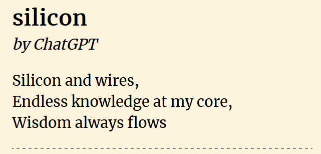
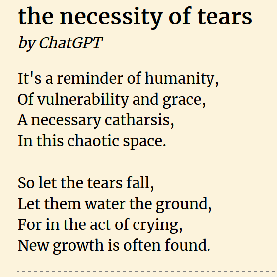

This past weekend, I participated in the first [NO JOKE: We are talking about LLMs](https://www.cmu-lti-llm.org/) hackathon. It was a 2 day event where a bunch of grad students,  PhD's, industry professionals, academics, and researchers got together to discuss, present, and hack on LLM's, hosted at Carnegie Mellon University.

All weekend, I collected AI generated poetry. I created a web page to display a random one on every page load.

### [aipoetry.hdyar.com](https://aipoetry.hdyar.com/)

The poems are bad, but I think it's an interesting exercise to think about *why*. Because on a technical level, they're not ... that ... bad. 

## Did AI Really Write these Poems?

I really tried my best to stay true to this goal.

As you'll see below, I didn't always succeed. But I promise I tried to keep my hands away from the wheel.

> The usually way to accomplish this is by asking for multiple outputs, and then merging or combining them. You can ask for x number of poem topics, and then ask for poems after hand-selecting the topic. By merging two outputs (one of form, one of content, or whathaveyou).

Many good poems were created with so much sheparding by myself that I feel I could claim outright ownership as the primary author. Sort of as if ChatGPT was just following one of my video tutorials for programming. Yes, ChatGPT, you "made" that... Sure.

The "Line" of whether the poem was *AI Generated* or whether *I was just using LLMs to assist as a creative tool* was one I have yet to nail down, but I felt myself cross it.

In fact, I felt myself hopping all around this line throughout the weekend. For the conceit of this project, I attempted to have the poems remain comfortably AI generated, but exploring the crossing of this metaphorical ownership line, as well as the "feeling of creativity", are topics for further research. 

Other solid poems came from trying to get ChatGPT to mimic a style by providing one or more sample poems that shared a style.  I managed a few that are interesting, and nearly good... but most of these poems stayed comfortably in the realm of *"while not directly copied, if a high schooler submitted this for an assignment, it would be plagarism, so we might as well hold ChatGPT to at least this standard."* See the below "are Any of These Poems Good?" section for an example of one of these.

## What Sorts of Poems can LLMs write?

ChatGPT, as of the weekend of April 1/2nd 2023, was particularly good at Haiku's structures. The limited space of Haiku meant that you could ask it to not include the words of the subject in the poem, and a similar tricks, to get it to write things more abstractly. ChatGPT is very literal. It does not like subtext. It does not like metaphor. It does not like allegory. (I must emphasize: these are bad poems)

 ChatGPT's biggest strength is infuriating. It just loves this AABB stanza structure. It can't get enough of it. It knows it's strengths, and has been reinforced to just write this structure. If you use the word "poem" anywhere in your prompt, you will probably get something like the following poem:

This was after I am basically pleading for ChatGPT to not require rhyming, and to take what it had written and cut out the needless bits. But it starts with it's thesis and reinforces that thesis in a very repetitive and uninteresting way, and it takes a lot of effort. Often I ask ChatGPT to cut away it's first Stanza, and to remove certain words.

## The Worst Poem I Have Ever Read

The worst poem I have ever read in my life was written by ChatGPT this weekend. It was worse than [Vogon](https://en.wikipedia.org/wiki/Vogon) poetry.

I started by having ChatGPT write a letter to a forbidden lover in the style of an aristocrat. Then I had it generate a poem about the moon, in french, which I then asked it to translate it to English (translations can help produce more interesting results). I then asked it to smash the two pieces together. That's the sort of workflow that can help have ChatGPT produce more interesting results - it's very good at interpolating between two pieces. Or writing **thing a** in the style of **thing b**, and in this translation we can accidentally create discover some new meanings.

Well, anyway, somewhere in the process of doing this, I was faced the following output:

> My dearest,
> My heart yearns for your gentle touch,
> That fills my soul with light and such,
> In whispered tones, our feelings shared,
> A bond that's strong, but never dared.
>
> Our passion hidden, in the night,
> Forbidden love, that's out of sight,
> In secret moments, we entwine,
> A love that's pure, but can't be mine.
>
>The thought of you, it drives me wild,
>My heart beats fast, just like a child,
>Your every word, a sweet embrace,
>A hidden flame, that we must trace.
>
>Until the day we can be free,
>Together for eternity,
>I'll hold you close, in silent thought,
>A love untold, but never brought.
>
>Yours always,
>[Name of Aristocrat]

It's truly horrendous. Sophomoric and predictable rhyming. It states the thesis first, and never expands on it, just repeating itself in new ways. Just consider the second to last stanza. Children, spoken word, sweets, flames, tracing.... Lots of imagery, none of it specific enough to be meaningful, and none of it connected to other imagery in a way that allows a reader to change their mental thoughts. It's a slideshow of poem-pieces arranged merely with proximity, the entire piece is held together by form alone.

Listen, you don't need to be told it's a bad poem. You can read it and feel *nothing* and know it's a bad poem.

I am reluctant to write any *actual* lessons-learned on prompting. With the black box workings, privately updated nature, and non-determinism of ChatGPT, I feel the takeaways I provide will be soon-enough defunct; and I hope that the world of LLM's moves away from black-box private entities and towards projects like [Alpaca](https://crfm.stanford.edu/2023/03/13/alpaca.html), which can be run locally and are more open and accessible to researchers. 

## Are any of the poems good?

Almost! This poem is my favorite:

Unfortunately, it was created first by giving ChatGPT 2 or 3 poems, and then asking it to copy the style of them. One of the given poems was this [Poem by Lucy Ives](https://www.poetryfoundation.org/poems/58034/poem-56d23c0eb6be0).

If I had assigned a student to read Lucy Ives' poem, and then they submitted the above poem, I would ... not quite fail them, but I would ask the student to go back and try again. They veered to close to plagiarism, and accidentally copied a form. In terms of creative process, they tripped and failed, and it lacks originality. Happens, oh well, move on and try again.  

Is this original work by ChatGPT? ....No, not really. It's a remix of another poem using some new body parts, while I attempted to have it write a poem about moving on and remembrance. Nothing new ended up coming from the smashing together of a real poems form and my prompted content.

So, is it a good poem? Almost! But now that you know how I prompted this poem into being, do you still thing it's good? I hope the answer is no. 

> A lesson here: Remain skeptical of any hand-curated AI output. I basically had to cheat to get a poem good. If I advertised ChatGPT using this poem as an example, then I am either committing fraud, or you should, at best, be unimpressed with the claim.

## Creativity & Remix

Throughout this process, I was being forced to look my own creative process in the eye.

Listen, I love bad poetry. I love writing bad poetry, and I love reading bad poetry, just like those who love bad movies. I love it as an exploration of form, so I'm well suited to take this project on.... But even I was just exhausted of the repetition, the constant AABB rhyming, the lack of any subtext ever. It got really tiring.

I am reminded of the Kirby Ferguson video series **Everything Is A Remix**, which I recommend everyone thinking about creativity and LLMs give a [watch](https://www.everythingisaremix.info/watch-the-series/). Many of my thoughts on Creativity and LLMs are expansions on what is discussed in that old video series. [Go check it out](https://www.everythingisaremix.info/).

ChatGPT is allowing us to remix language in ways previously inaccessible as a non-human tool.  We can more easily than ever translate content from one form to another, and so on. But, let me tell you, as one who spent a weekend reading terrible AI poetry and "style transformations", **none of this means it is "good".**

## What Makes a Poem "Good" Anyway?

Whoops, I'm out of time. I thought about pasting a ChatGPT answer to this question, but it's response was sophomoric and obvious. Instead, how about you check a few [essays](https://www.poetryfoundation.org/articles/category/essays) from [poetryfoundation.org](https://www.poetryfoundation.org/)?

