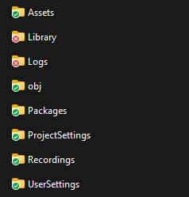
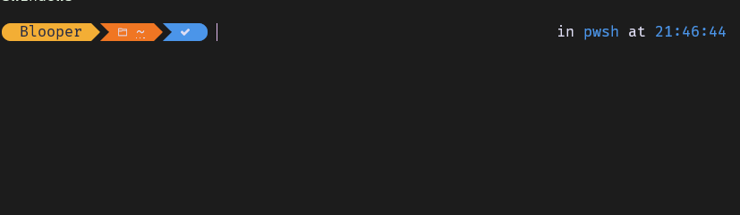
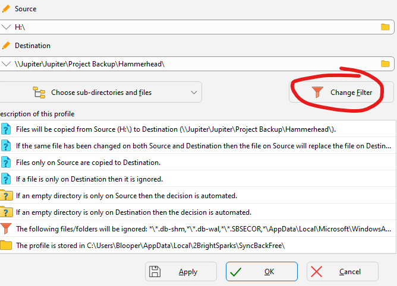
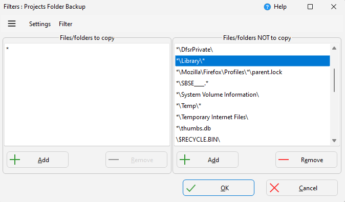
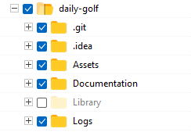
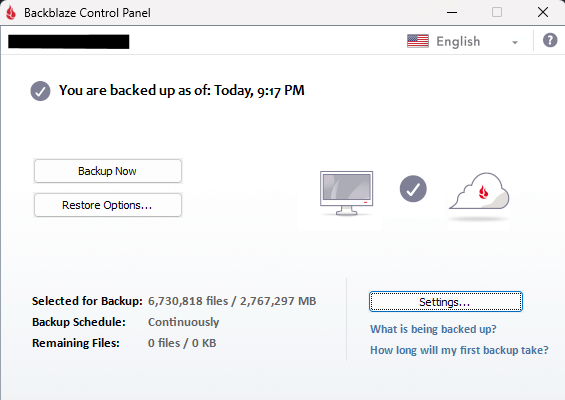

Backing up Unity Projects is a pain. They are large and full of small files that are a pain to copy. Regardless, backing up your work is important! Here's how I do it.

## A Consistent Folder Setup
I keep a "Unity" folder that contains all of my Unity projects. I use this structure for all of my projects that I organize by workflow. I also have /projects/godot, /projects/unreal, and /projects/arduino folders, for example.

The only important note here is that I use the exact same folder structure on all of my machines. This helps me merge and combine unity project folders to my 'master' NAS backup ([Synology](https://www.synology.com/en-us/products?product_line=ds_j%2Cds_value), and also makes finding files consistent and thus easier.

## Project Naming Structure
I generally just try to keep my project names memorable, not worrying about the names too much *(You [can](https://stackoverflow.com/questions/45825612/how-to-rename-a-unity-project) just change this later)*. I only follow the following rules:

- Temporary 'delete-able' projects have the word "temp" in the name. *Go through and delete them from time to time! It's cathartic!*
- Projects by others (I am often sent student projects to help debug) go somewhere else, not to be intermingled with 'my' work.
- CamelCase, no snake_case or kabob-case.

*(If I worked on mac or linux more often, I would probably change most of my folders to be lowercase; if only to make cd-ing around in [terminal](https://unix.stackexchange.com/questions/60276/why-is-the-terminal-case-sensitive) [easier](https://unix.stackexchange.com/questions/60162/how-to-make-cd-arguments-case-insensitive))*

## Unity Projects & The Library Folder
What is the Library folder, and why is it so evil?

Let's check the [Unity Manual](https://docs.unity3d.com/Manual/ImportingAssets.html):

![Unity stores the internal representation of your assets in the Library folder, which behaves like a cache folder. As a user, you should never need to alter the Library folder manually; if you do, you might negatively affect your project in the Unity Editor. This also means that you should not include the Library folder under version control. Note: If your project is not open in Unity, you can safely delete the Library folder, because Unity can regenerate all of its data from the Assets and ProjectSettings folders the next time you launch your project.](manual-library.png)

We don't want to backup the library folder because:
1. It's a waste of backup space, since the folder is determinstic.
2. When moving to a new computer, it's probably going to re-generate a lot of the folder anyway.
3. It's slow. The library folder has a **lot** of very small files, which will make the backups *extremely slow* because of file system reasons more than time-to-copy-bits-of-data reasons.
4. No really, It's really slow. I can't stress enough that this will slow down the backups, or just copying the project to an thumb drive. In my experience, it's usually faster to **regenerate** the library folder than it is to copy it.

> Hey kids, ever tried to copy a minecraft map folder somewhere, and it just takes forever? Same deal.

*In Godot, you want to ignore the .godot/ folder, and in Unreal projects ... it's more like... what can't you [ignore](https://github.com/github/gitignore/blob/main/UnrealEngine.gitignore)?*

### Do Not Use OneDrive/Dropbox for Unity Projects
Do not use file syncing software, like OneDrive, Dropbox, or iCloud, or Synology Drive; for Unity projects.

This is for two reasons:

1. They will constantly have to re-index the library folder as you work, and it will cripple your poor drive as it tries to scan all those tiny files.
2. Many services offer to 'free up space' by [deleting](https://support.microsoft.com/en-us/office/save-disk-space-with-onedrive-files-on-demand-for-windows-0e6860d3-d9f3-4971-b321-7092438fb38e) [local](https://support.apple.com/guide/mac-help/optimize-storage-space-sysp4ee93ca4/mac) [copies](https://www.dropbox.com/features/sync/save-space), keeping symlink-like fake-copies that will download as needed. They claim this is a feature. This absolutely does not work for Unity's library folder.

So, if you do have a your work inside of Dropbox, or whatever, go in to every Unity project and tell it to ignore the Library folder.

## Not-Really-A-Backup-But-Still-Convenient: GitHub
Git [isn't backups](https://rewind.com/blog/git-clone-not-backup-solution/)! Git is your working project, and it requires being backed up.

> "What do you mean GitHub isn't a backup?" You're telling me you've never borked a git repo? You're telling me you've succesfully un-initialized LFS and had submodules work perfectly, every time? The thing that also serves as something of a portfolio for programmers, which needs to be cleaned up and organized and perhaps only show your best work?
>
> Yeah. Not a backup.

That being said, I do really find it nice to have my projects in some version control, be it git, perforce, or unity's own evolving solutions. I just have to make sure I trust the host of these servers.

I mean, I pay for my own cloud server to run perforce, but I really should shut that thing down... If **I can't even trust myself** to keep cloud servers running, how am I supposed to trust anyone else? You need local copies!

Local copies are [fast as heck](https://what-if.xkcd.com/31/) too. Plus, running automatic operations on version control repositories is a pain. Having one project on GitHub is great for that one project, but when it's time to download *all* of your projects? [Dev Home](https://learn.microsoft.com/en-us/windows/dev-home/) can't come soon enough.

## Backup Strategy One: SyncBack
On Windows, I use the software SyncBack by 2BrightSparks. I paid for SyncBackSE once, like 12 years ago? I'm on so many computers I usually just install the free version, it does everything I need - I only bought the paid version to support the developers. It's good enough software, and I like that it's [finished](https://josem.co/the-beauty-of-finished-software/).

The website absolutely looks like adware. I hate the website so much that I always install it through [Winget](https://learn.microsoft.com/en-us/windows/package-manager/winget/).

### Ignoring the Libary Folder
The trick is to get SyncBack to ignore just the libary folder in our backups. How?

First, create the backup profile like normal, copying the Unity Projects folder from one source to it's backup destination. The software is pretty simple and the UI clear, you will figure it out. In my case, the destination is a folder on my NAS; but you can use external drives or what-have-you.

Next, open the profile settings (Right click > modify) and choose 'Change Filter'.

Then, in the filters window, add an option to the right list, Files/Folders NOT to copy. Add the rule "\*\Library\\\*"

I also ignore the 'Temp' folder the same way.

Lastly, double check it's working correctly! And you aren't ignoring that wonderful 'Libary' project, or using this for tools/projects that require 'Libary' folders! (Arduino?)

The first time you set up a backup profile, you can perform a 'simulated' run. Do it! Check that it's actually backing everything you want up.

## Mac software: SyncTime
On Mac, I do basically the exact same thing with [SyncTime](https://desairem.com/wordpress/synctime/). It's $10 and worth it.

I also have an SSD set up with [Time Machine](https://support.apple.com/en-us/HT201250), which is ALSO good software. I don't only use time machine, because I want something I can easily plug into another machine and grab data from in an emergency.

## Backup Strategy Two: Backblaze
I have been a happy user of [Backblaze Cloud Backup](https://www.backblaze.com/cloud-backup) for over a decade. I backup three machines with it. *(Actually four, I also pay for my Mom's laptop backups as a renewing gift)*. I have nothing but positive experiences with the company. Set it and forget it!

If I really feel like procrastinating, I will go into the backblaze settings and ignore library folder's. I usually forget to do this, and it's fine. It's probably fine.