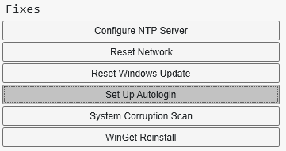
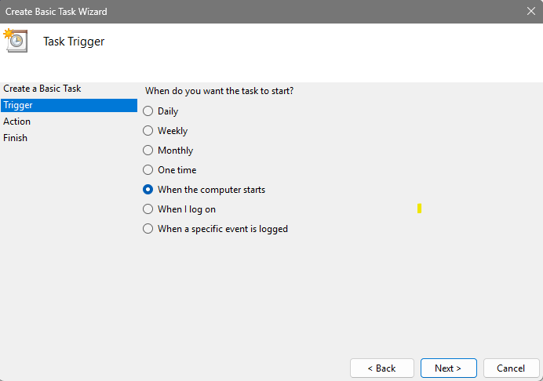

In the Immersive Media studio, one of our project showcase tools is an arcade cabinet. It runs multiple games, and we need a way to switch between them, and to leave old projects accessible.

Naturally, I built a custom launcher for it. While simple, it uses a few tricks that may be nice to know as software developers, and on how I set up the machine to run everything automatically.

You can see the entire source code on the [Github Repository](https://github.com/hunterdyar/ArcadeCabinetLauncher).

The magic is spawning the process from our own executable, then listening for that process to close. For this, C# provides the [Process](https://learn.microsoft.com/en-us/dotnet/api/system.diagnostics.process?view=net-10.0) class.

## Launching and Watching Processes

~~~csharp
public void Launch()
{
    if (_launchProcess != null && !_launchProcess.HasExited)
    {
        Console.WriteLine("Can't launch another process, already running one!");
        return;
    }
    
    var target = _targets[_currentSelected];
    CurrentlyPlaying = target;
    _launchProcess = Process.Start(target.ExectuableFile.FullName);
    _launchProcess.EnableRaisingEvents = true;
    _launchProcess.Exited += OnProcessExit;
}

public void OnProcessExit(object? sender, EventArgs eventArgs)
{
    _launchProcess = null;
    CurrentlyPlaying = null;
    Raylib.SetWindowFocused();
}
~~~
*From [TargetManager.cs](https://github.com/hunterdyar/ArcadeCabinetLauncher/blob/master/ArcadeCabinetLauncher/TargetManager.cs)*

In the Process that we get from Process.Start (stored in '_launchProcess'), we turn on EnableRaisingEvents and subscribe to the Exited action. When it exits, we refocus the window of the launcher.
I'm using "if process is null" as a way to track the program's state. Simple and lazy.

In my implementation, Target is just a trivial struct to wrap up the info of our applications to launch. If we had thumbnails or such for the projects, we would store those here. [FileInfo](https://learn.microsoft.com/en-us/dotnet/api/system.io.fileinfo?view=net-10.0) is a useful C# class for, well, information about files.
~~~csharp
public class Target
{
	public FileInfo ExectuableFile;
	public string Title;
}
~~~

## Scanning a Directory
We are provided (by a command argument) the directory with our games in it.

We turn that string into a [DirectoryInfo](https://learn.microsoft.com/en-us/dotnet/api/system.io.directoryinfo?view=net-10.0) object. I've called 'Directory' in this code sample.

> I also watch that directory for changes. This way the launcher can be running and we can add or remove files from it after the fact. Whenever there's change, I just recreate the list from scratch. 
> 
> That is done with a [FileSystemWatcher](https://learn.microsoft.com/en-us/dotnet/api/system.io.filesystemwatcher?view=net-10.0) class. You can see how I implemented that [in this function](https://github.com/hunterdyar/ArcadeCabinetLauncher/blob/c7408affddc80ff880d02b1445ba649345a059f3/ArcadeCabinetLauncher/TargetManager.cs#L21).

The DirectoryInfo class has a convenient 'EnumerateFiles' function. We'll loop over all of the files, look for ones that we can run, and add them to our list of available targets.

We scan recursively (SearchOption.AllDirectories) so that students can just drop a Unity Build folder in easily.

We also look for '.lnk' files. These are the files created when you make Shortcuts (right click>new>shortcut). That way projects can live wherever, and we can still launch them.
This might help, since I am using the executable filename as the display name - if you can't rename you exe for whatever reason, you could at least make a shortcut with a pretty name.

[WinShortcut](https://github.com/louietan/LnkParser/) is not a C# class, it comes from a [different library](https://github.com/louietan/LnkParser/) for parsing .lnk files. This library hasn't been updated in 10 years... but it's fine! shortcuts haven't changed either, not [really](https://thehackernews.com/2025/12/microsoft-silently-patches-windows-lnk.html).

~~~csharp
private void RecreateTargets()
{
    _targets.Clear();
    foreach (var executable in Directory.EnumerateFiles("*.exe", SearchOption.AllDirectories))
    {
        if (executable.FullName == Environment.ProcessPath) //don't add ourselves to the list
        {
            continue;
        }
        _targets.Add(new Target()
        {
            ExectuableFile = executable,
            Title = Path.GetFileNameWithoutExtension(executable.Name),
        });
        Console.WriteLine($"Found Exe: {executable.FullName}");

    }

    foreach (var executable in Directory.EnumerateFiles("*.lnk", SearchOption.AllDirectories))
    {
        var link = new WinShortcut(executable.FullName);
        FileInfo source = new FileInfo(link.TargetPath);
        _targets.Add(new Target()
        {
            ExectuableFile = source,
            Title = Path.GetFileNameWithoutExtension(source.Name),
        });
        Console.WriteLine($"Found Linked: {source.FullName}");
    }

    if (_targets.Count == 0)
    {
        Console.WriteLine($"-- Found no exe files in {Directory.FullName}");
    }

    _targets = _targets.OrderByDescending(x => x.ExectuableFile.LastWriteTime).ToList();
    _currentSelected = _targets.Count - 1;
    
    OnTargetListUpdated?.Invoke(this);
}
~~~

## Input and Rendering

To display, I am just using Raylib. Stateless UI means we render the entire program every frame from 'first principles'. Our state is just "is a program running?" and "which item are we hovering on?". That means the rendering script is [nothing to write home about](https://github.com/hunterdyar/ArcadeCabinetLauncher/blob/master/ArcadeCabinetLauncher/LauncherWindow.cs).

The last trick to the launcher is input. I had trouble with Raylib's system - I think my USB devices didn't read as "gamepads" (but were "joysticks"?) and raylib didn't like them for whatever reason? Not sure.

I bypassed the problem by using an [HIDDevices](https://github.com/DevDecoder/HIDDevices) package to read them separately. I think this problem is unique to my setup, so anyone else creating something like this may want to skip that.
If you're forking my project, I split the different logic out to different functions in the [InputManager](https://github.com/hunterdyar/ArcadeCabinetLauncher/blob/master/ArcadeCabinetLauncher/InputManager.cs) script, so just turn whichever on or off.

## Setting up the Machine
I start with a fresh install of windows, and use the [Chris Titus Tech's Windows Utility](https://winutil.christitus.com/) to debloat the machine and - most importantly - turn on autologin.

.

To launch the launcher on boot, nothing is simpler than using the Windows built-in [Task Scheduler](https://en.wikipedia.org/wiki/Windows_Task_Scheduler) feature to launch our launcher build on boot.

With those two things done, we can now boot the program and have it open and run the launcher on boot. The arcade controls don't have an 'escape' button, so quitting to the desktop and setting up new projects means plugging a keyboard in. That's perfect for us.

Finally, the only add for the students: they need a way to [quit](https://docs.unity3d.com/6000.0/Documentation/ScriptReference/Application.Quit.html) the game, in their game. This is... surprisingly uncommon in student projects! When testing in the editor, this just doesn't matter - so I have to remind students about the requirements for the build.
I think a future feature to add would be some kind of extra button on the cabinet that would automatically exit the game and return. Many emulators use a feature like that.

Full source is available on [GitHub](https://github.com/hunterdyar/ArcadeCabinetLauncher).

