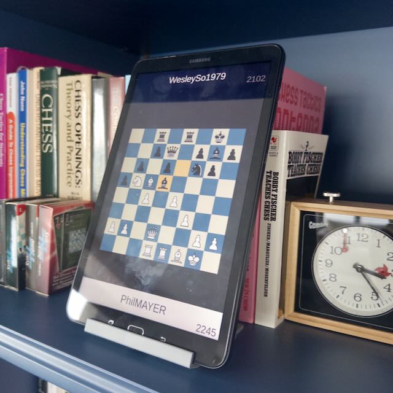

My dad is a big chess fan. For Christmas this year, I created a gift. A display that constantly streamed live chess games.

For the display, I simply used a 2018 Galaxy Tablet I was given for free. Recycling! 

For the stand, I designed and 3D printed it myself. I am a week or so into learning Fusion 360, and I am still quite a novice at the software. After more pain than it should have caused, I had a tablet stand printed.

Finally, for the game itself, I created the viewer from scratch in Unity. 

The project code is available on [GitHub](https://github.com/hunterdyar/LiveChessGameViewer/). The 3D view doesn't really work. When it comes to clean code practices or nice architecture, I did not walk the walk. It's sloppy! But it gets the job done.

The project works like [Lichess TV](https://lichess.org/tv).

First, I poll the [Lichess API](https://lichess.org/api) for a list of channels - game types. Then I find an appropriate game (the default is "best", which shows high rated players), and connect to it. 

The trickiest part was the netcode. I connect on a separate thread - which Unity does *not* love to do - and it keeps a connection active. Every new move for the game is a new line that's a JSON blob. The entire file is not valid JSON, just each line. It assumes you are parsing just the newly received bits.

I update some state objects silently from that thread, then check that data in a read-only way inside the Update loop to bring my logic back to the main thread. From there, turn the [FEN](https://en.wikipedia.org/wiki/Forsyth%E2%80%93Edwards_Notation) into a game-state board (which is a fun programming challenge). 

The next hardest part was comparing the new and previous boards and figuring out what move was played. The move is provided by the netcode, but it's tricky to parse - lot's of assumptions are baked into it. I thought it would be easier to just look at the two game states, find the differences, and animate them. The benefit being that I could handle invalid states, like if I missed a packet or they came out of order, it would sort itself out automatically.

 Should be easy, right? It was not, and I regret the approach immensely. This [code](https://github.com/hunterdyar/LiveChessGameViewer/blob/7de2cf1560445abc1c8a365ba139da1560caa172/Assets/Scripts/ChessGame/ChessMove.cs#L107) is a disaster. But it does work!

The last challenge was turning a tablet into an always-on display. Putting the tablet into developer mode allows you to turn on a "stay awake while plugged in" option in the developer settings.

The gift was a huge success! Not bad for something that only cost me a dollar or so of plastic fillament, and my time spent programmning it.  

