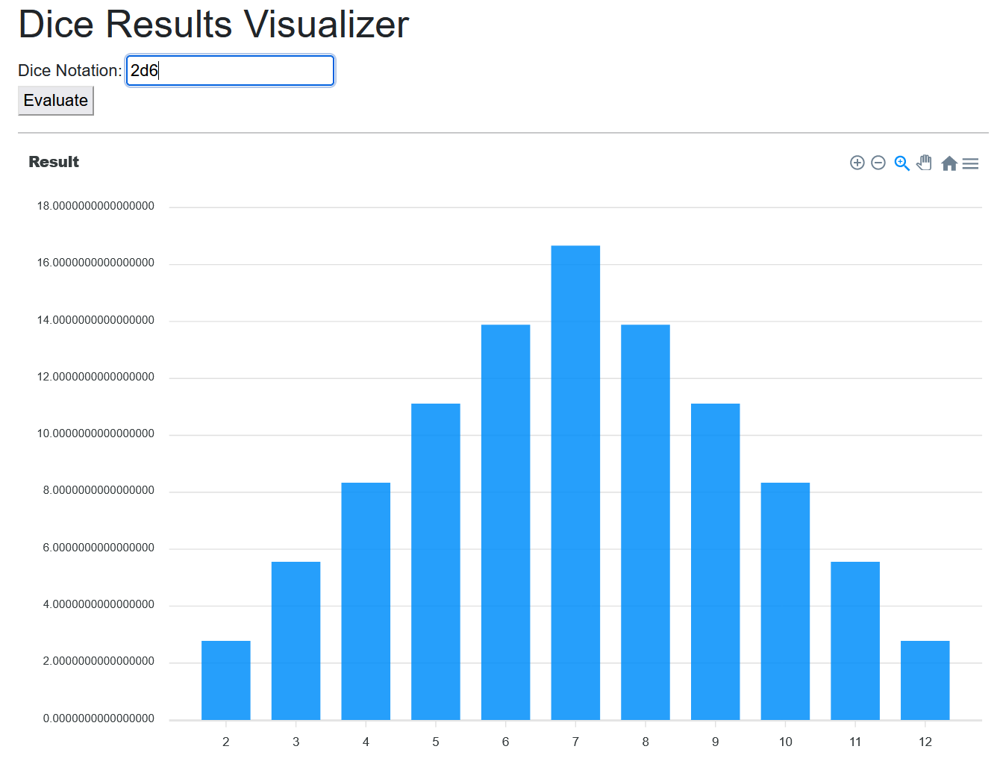

I created a simple webapp that allows you to enter standard dice notation, and get the probability of different results in pretty graphs.

Check out the project at [diceresults.hdyar.com](http://diceresults.hdyar.com), and the source code on [github](https://github.com/hunterdyar/Dice-Results-Visualizer).



## Why?
A while ago, I was working on a [3D Dice Roller](https://github.com/hunterdyar/3D-Dice-Roller-Unity) package for Unity. This is a more useful tool, and I do plan to finish it. In writing it, I had to put together a simple dice parser. The idea of polishing that never quite escaped me.

Later, my friend started working on a clone of some of the features of [anydice](https://anydice.com/), for a web-based RPG toolkiit they are still hacking on. We talked about how to implement things, and I just got that itch - I had to know if I could make it myself. How would I do it?

This is a one day jam project, and nothing to be taken seriously. (go use AnyDice, it's great!). But it's fun to explore parsers.

## How It Works
The skeleton is in Blazor. I am using blazor for the [server](https://github.com/hunterdyar/Clayze-Server/) for the [clayze project](https://clayze.hdyar.com), so sticking with that was an easy decision, as it helps me learn the tool.

The interesting parts are the Dice Parser and the results calculation. 

### Parsing Dice Rolls in C#
I used the [sprache](https://github.com/sprache/Sprache) parser combinator library to write the [parser](https://github.com/hunterdyar/Dice-Results-Visualizer/blob/main/dice-results-viz/Dice/RollCodeParser/DiceCodeParserSprache.cs). I originally wrote the parser by hand, but it was bugging me out.

With Sprache, assembling a parser is pretty simple, the code just looks like this.

```csharp
public static readonly Parser<Expression> NormalDiceRoll =
		from d in Number.Optional()
		from sep in DiceSep
		from f in Number
		select d.IsDefined ? new DiceRollExpression(d.Get(), f) : new DiceRollExpression(f);
```

Here, "Number" and "DiceSep" are other parsers. They all get combined together in a way that roughly matches the hierarchy of the language one is parsing. This expressiveness is what makes a [parser combinator](https://en.wikipedia.org/wiki/Parser_combinator) so powerful.

### Calculating Possible Results of Dice Rolls
I treat every value as a dice roll, which are basically arrays of faces. A modifier number (the +3 in 1d20+3) is just a one-sided dice. I take all of these roll-segments and combine them together with their modifier (+,-,x,/). 

Combining them is just brute force. In the roll 2d4, I take a [1,2,3,4] and add it to [1,2,3,4] by adding every value together, producing [1+1,1+2,1+3,1+4,2+1,2+2,2+3,2+4,3+1,3+2,3+3,3+4,4+1,4+2,4+3,4+4]. 

> At this point, I imagined my old linear algebra professor reminding me there was a much easier way to do things. Probably.

That's basically it. It's brute-force method, and... it's fine. Computers are fast. Besides, if you wanted to do this for real, than just use [anydice](http://anydice.com)
