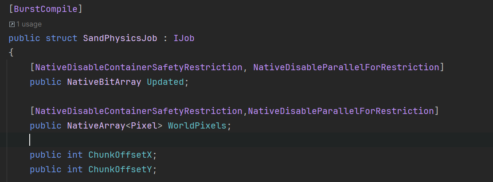
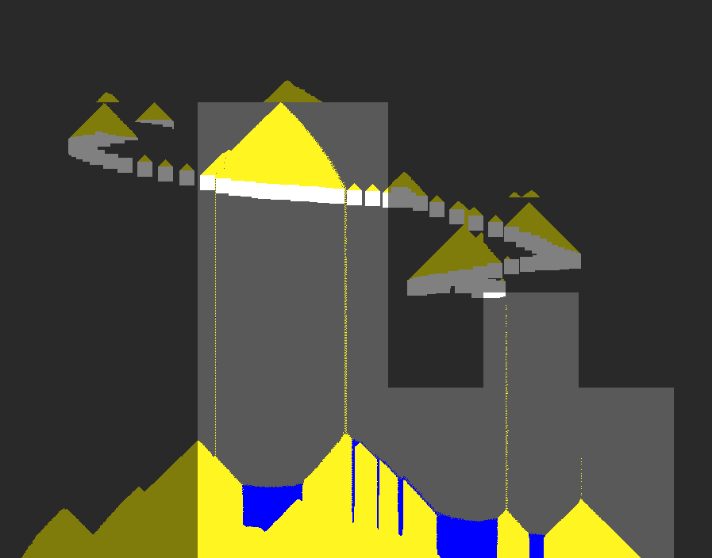

For the Game Makers Toolkit Jam this year, the theme was 'Built to Scale'. I decided to make a [falling sand](https://en.wikipedia.org/wiki/Falling-sand_game) in Unity. I managed to leverage the Burst compiler and the Jobs system to make a simulation that can handle over ;a million particles.

My only goal was to try and push my limits of how big I could make the simulation, here is what I learned.

## Entities, Objects, or Automaton

### Objects

There are three main ways to handle a large simulation like falling sand. With Objects, every particle is it's own object and contains all of the components and references it needs to draw and simulate. This would be GameObjects in Unity.

This has the most overhead for instantiation and simulation, but is generally the most convenient to work with. Frankly, computer's are pretty fast. If you don't have a reason to optimize things as much as possible, don't! It's probably better to choose an approach that is easier to implement, understand, and - perhaps most importantly - debug. Work in the way that is the fastest to test ideas when prototyping, and then refactor or rewrite the project to be more optimized if needed - and when you know how it all will work. 

### Entities

Entities are the second main approach. Game engines call a system "ECS" or Entity-Component-System. Instead of objects owning their own behaviours, objects are flyweight blobs of data, structs that can be efficiently looped over. Single systems loop over them and do what they do, draw a mesh or adjust their settings. This is how particle systems are implemented in Unity, and ECS systems and particle systems generally share the same principles here. The downside is getting the entities to interact with each other, or with dynamic elements of the environment. Nothing is inheirently impossible about these tasks, they just don't imlement easily when using read-only structs, parallelization, and so on.

Unity has it's DOTS or ECS framework, which it has announced and supported. It has been in a pre 1.0 version and during development has had a lot of breaking updates and API changes. All of the resources for it are likely to be out of date, and Unity doesn't appear to be spending a lot of time updating them. I started with Unity ECS for this project, and while I had promising initial results in terms of performance, I quickly gave up after being too frustrated by out-of-date resources. This project is supposed to be for fun!

### Automaton
The final main way to approach a falling sand simulation is not to save the data as entities, but as a large grid. Usually an image. This makes it easy to access the locations of objects, but not easy to access the objects at all. One generally has to loop over the entire grid every frame, even if there is no sand at all present. [Conway's Game of Life](https://en.wikipedia.org/wiki/Conway's_Game_of_Life) is a well known cellular automaton. 

After spending a lot of time struggling with rolling my own multithreaded entity system, I eventually pivoted to a cellular automaton approach, and finally started making progress.

## Accessing Data

Another way of thinking about this was how you access your data. If the information is stored by entity, then it's convenient and efficient to find your entities and simulate them; but they need to know what entities are in surrounding cells.

If you data is stored by cells, then it's convenient to find the neighbors and test/sample them, but annoying to find your entities. I started working with the first method, but pivoted to the second.

## Multithreaded Code

The biggest challenge of this project is getting the multithreaded code working was dealing with the trouble of parallelization and state.

Optimizing the code means splitting the task across multiple CPU cores. Each core either get's it's own copy to work on and share the results from, or it works with the same single section of memory. Manipulating the same memory at the same time is a bad idea! 

*"Disable Safety Restriction"? Probably fine.*

I implemented a chunking system that was described in the [GDC Talk](by the developers of Noita). Despite having a single massive array for my data, the simulation couldn't write to the same pixel at the same time, neighboring chunks were not simulated at the same time.

Doing this meant I had to turn off Unity's Job System's helpful and important warnings about writing to items that are not currently being iterated over.

The fastest running code is code that doesn't run. I track if the chunks have been changed the previous physics tick, and - because my system has a stable state - this means I can stop simulating chunks that aren't moving.

This dramatically improves performance, of course. 

## Performance
My goal was to hit the 1 Million active particules simulated at a reasonable frame rate on a high-ish end gaming PC. And I achieved it. Keeping all chunks active on a 1920x1080 simulatino is a juicy 2,073,600 cells getting simulated at around 30fps. Nice! It scales well to my multi-core processors, as long as I have enough cores to run a third of my chunks (my simulation runs on a third of the chunks, 3 times each update, to cover them all). 

Only one issue... It's boring.

## How To Make It Fun
Finally, the problem. This toy isn't fun to play with at all. I have a lot of ideas on how to make it more fun, but... they are out of scope and challenging to implement. Nothing with what I have made is *surprising*. There are no emergent behaviours, no satisfaction to supply to curiosity. 

What I would do is add an entity system on top of the automaton system. I would simulate [lemmings](https://en.wikipedia.org/wiki/Lemmings_(video_game)) on the sand, manipulating it, building, digging, exploring, and probably getting crushed a lot. That... might be fun?

Most falling sand games that are fun do one of two things:

1. Add Explosions
2. Add reactions between elements

Great ideas. Someone should do those.

I'm going to shelve the project, play Noita for a bit, and take the lessons I learned on multithreading with me to future projects.

If you're curious, the project is [open source on GitHub](https://github.com/hunterdyar/Sand-Falling-Unity).
