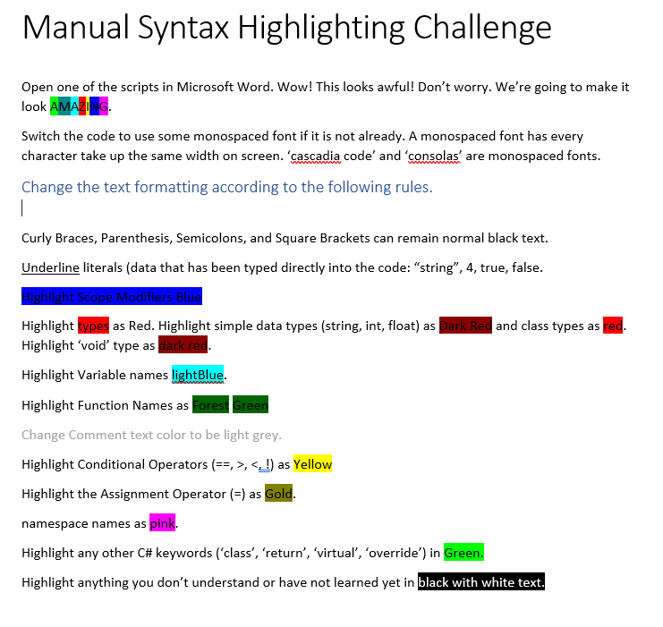

When teaching programming, I use a hybrid-flipped approach. I use video and "remote lecture" activities (flipped-classroom) purely as a way to prioritize the time I spent watching students program in the classroom.

Nothing is more effective than watching a student write code at understanding their mental model. From there, providing direct feedback in a 1-on-1 over-the-shoulder way.

However, just working on projects isn't always the best use of classroom time. One isn't always doing "The conceptually interesting thing" when working. Sometimes they are just fixing fiddly syntax errors. Or, they just spend a lot of time typing. 

> Students who grew up with iPads are generally very poor typists, and they over-value using the mouse to manipulate text instead of erasing and re-typing things.
> I try to teach them shortcuts and tricks, and even do in-class typing tests to bring students awareness to the fact that, yes, they can simply practice typing. It will help!

To get to the 1-1 instruction and feedback as I take laps around the room, I need the students doing challenging and focused puzzles. Here are two of my favorites.

# Manual Syntax Highlighting
"Close your IDE's! You don't need them! Open everyone's favorite text editor: **Microsoft Word**."

At ths point, the students are already extremely wary. I then provide them with a zip file containing a handful of .docx documents that, themselves are copy-pasted from various scripts. Real-life ones, good and bad, that I simply pulled from projects.

The second word document they get is a list of instructions for the students to follow. My current version looks something like this ([download .docx](./Manual Syntax Highlighting Challenge.docx)):

> I got feedback that this is, predictably, not color-blind friendly. I should update it.

This is a hilariously ugly challenge, and the students hate it! 

> The fact that I cackle maniacally while making the students "suffer" through this challenge is probably unrelated.

BUT It's incredibly effective at getting students to start understanding how the computer is parsing what they type, and forces them to think more intentionally about the keywords and jargon of programming.

I highly recommend you try something similar in your classrooms. I have noticed a remarkable improvement in students ability to debug syntax issues, and read/parse code just from doing this once.

I give them a handful of scripts to choose from. I only say they can't use the same as someone they are sitting next to, and otherwise I am letting students self-select into different difficulty levels.

# Make The Errors On Purpose

The next challenge is to help them develop a better understanding of common error messages. The challenge is simple: Write code that (on purpose! Gasp!) produces certain error messages.
They then screenshot the error from their console and paste it back into the Word document. I just look at it during class (Ungraded, I don't give quizzes or tests), but it could be a submitted assignment.

In practice, this does a lot of things for the student. It forces them to actually read error messages, for one. Recreating the message means they have to understand what sorts of issues cause them. 
This has been an extremely effective "moment it clicks" for my students, in terms of not feeling so afraid of the errors.

> I often hear "It's mad at me..." when they talk about errors. "No!" I interject. "It's not mad. It's only asking for help!"

### Example
For C# (and Unity), my current set of errors for them to recreate are the following:

1. error CS0103: The name ‘SuperDuper' does not exist in the current context
2.	error CS1002: ; expected
3.	error CS1513: } expected
4.	error CS1547: Keyword 'void' cannot be used in this context
5.	error CS0266: Cannot implicitly convert type 'float' to 'int'. An explicit conversion exists (are you missing a cast?)
6.	error CS0664: Literal of type double cannot be implicitly converted to type 'float'; use an 'F' suffix to create a literal of this type
7.	error CS1503: Argument 1: cannot convert from 'string' to 'int'
8.	error CS8803: Top-level statements must precede namespace and type declarations.
9.	error CS1501: No overload for method 'Dance' takes 3 arguments
10.	error CS7036: There is no argument given that corresponds to the required formal parameter 'a' of 'InClassChallenge.Dance(int)' (Highlighted parts doesn’t need to match)
11.	NullReferenceException: Object reference not set to an instance of an object
