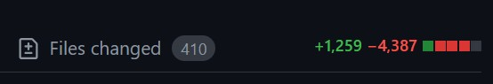
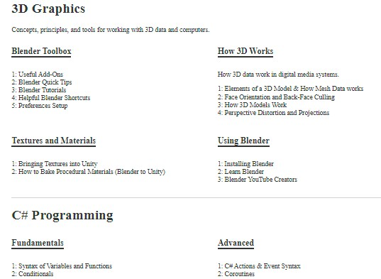
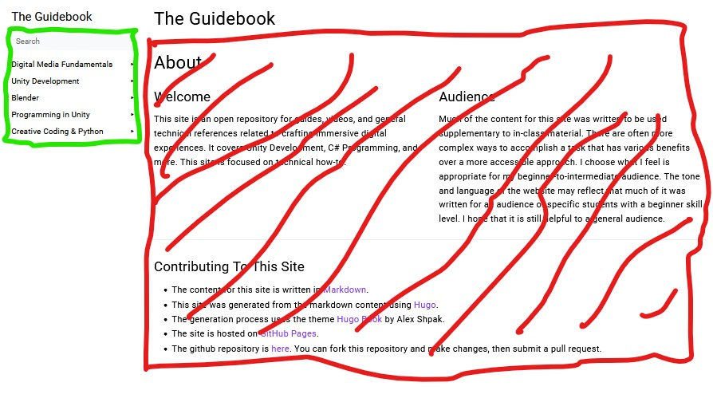
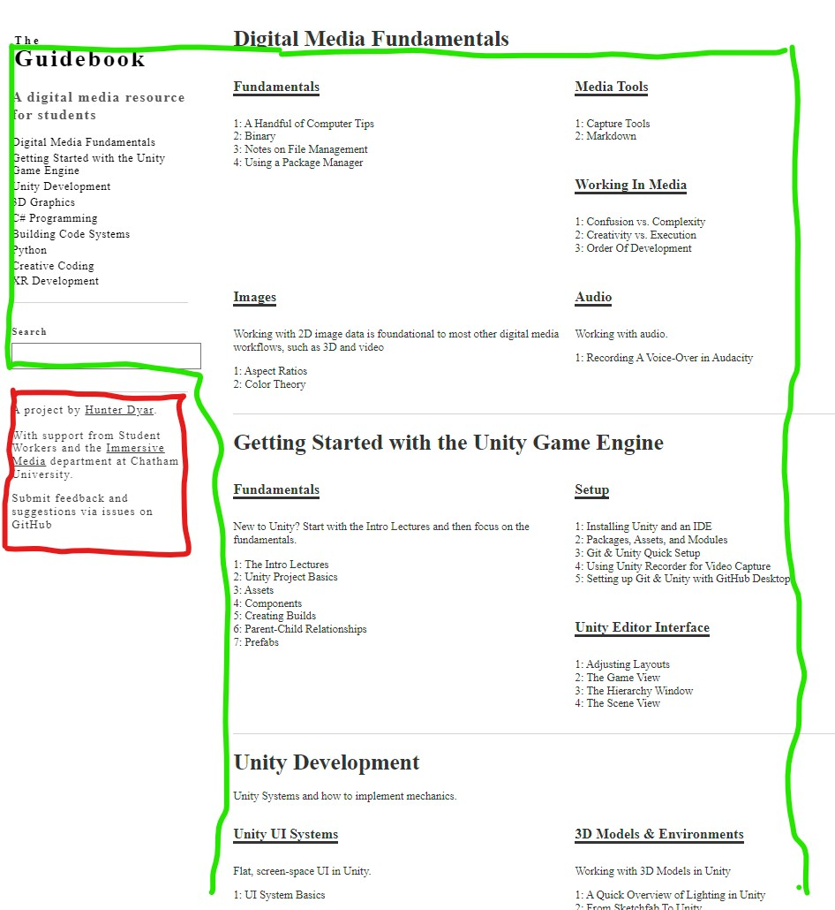
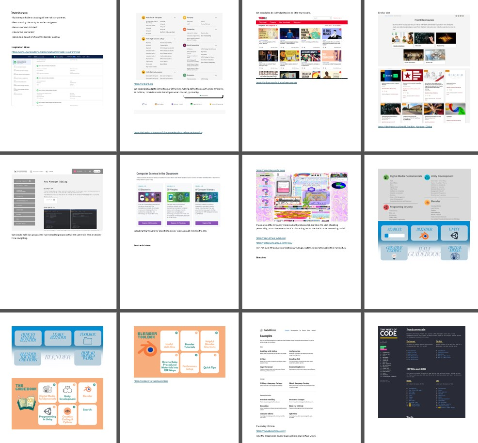
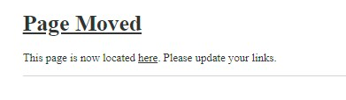

I've been working on [guidebook.hdyar.com](https://guidebook.hdyar.com/) for years, now. It's my longest running academic project, and something of a repository for various class lessons, notes, and resources. 



*This ended up being a very large project.*

While primarily about Unity development, the purpose of the guidebook is not content related ("be a Unity resource") The objective is user-defined: It's a resource for my students. ("Here's how to do that thing I see student's needing").

> It's also a repository for my flipped-classroom lectures that allows students to get these resources later, after the LMS is closed or after they graduate. Plus, I can update pages.

All of this means that the content is not organized towards a single goal. I couldn't write it as a book, with a single ordered learning path from start to finish. The content is a jumbled assortment of information that is useful to various skill levels, learning styles, and domains. 

This has basically been fine, as I mostly link to the guidebook from LMS's and elsewhere... but it finally got out of hand. 

## Design Research
I constantly observe my students using the guidebook. Anticipating this redesign, I simple did so intentionally, taking notes.

#### Observations
Students basically never used the navigation sidebar, Instead, they would use the search bar. When they did use the sidebar, they would unfold most categories semi-rendomly and scan through all the items until they found what they were looking for.

Whether through using the search function, or manually searching via scanning themselves, **search** has become the primary way to find articles. 

Takeaways:
- Search is a must
- Article titles are important. They should be descriptive and unique
- The thin navbar encourages shorter (and less descriptive) article titles
- Having navigation in collapsing sections leads to extra clicks
- Introducing "Scan-ability" is a high priority

## A Problem of  Taxonomy

Most of the content exists in a multiple conceptual categories. Consider an article on how to switch scenes in Unity. This is a beginner concept, about writing code with C#, and a quick reference more than a lesson. This could go in the "Programming", "Unity", or "Toolbox" sections easily. 

Which category? My constant pain. How to organize content that can fit in multiple buckets so easily? The right answer to this question is that there is no right answer, we need to change the situation so this question stops getting asked.

### Problem 1: Unclear High Level Categories
If we're guessing where it goes, users will guess where it goes too, and because they are users, they will _always_ guess wrong. 

> Design Rule no. 228: Users are unlucky like that.

### Problem 2:  Discoverability

> My student's don't know what all is in the guidebook! This hasn't come from observation research or clickthrough analytics. It comes from my own anecdotes. A student asks me how to import textures or such into Unity, and I reply by sending them a guidebook link. "Oh, I didn't know you had this. Thanks!"

It would (selfishly) benefit me if the students were able to discover resources before requesting them. How many students are finding bad (incomplete, out-of-date, poorly explained) resources on YouTube instead of utilizing their professor? At the college they pay for? I am their best resources, and the more they use my asynchronous materials, the more comfortable they are asking my for [synchronous] help. That's a good thing!
## The Solution
My solution is twofold: **content reorganization** and a complete **website redesign**.
## Content Reorganization
I flattened the taxonomy. First, I removed all high level categories that were the main cause of ambiguity (ie: no "Unity" or "All Programming" categories allowed). I worked the rest into a larger number of more descriptive categories. A new Virtual Reality, Code Architecture, 3D Modeling, etc. sections appeared - sensibly. 

The top level categories are now just website sections, visual breaks to help one's eyes scan quickly. 



*One can quickly jump past 3D graphics to get to C# programming, but the real categories are below each one.*

First, I removed the idea of a "Unity" (or "Blender", etc) section. I decided that sections should concepts driven, and tools second. This gave me the fewest weird edge-cases as I organized. The actual important thing is **consistency**.

Since my users are often looking for specific content that they know exists, it's easy for them to jump to the correct high level category so long as it's descriptive. They *mostly* don't have to guess anymore.

> There is still some ambiguity. When covering Unity Systems, for example, how the audio or animation system works should be in an 'Audio' or 'Animation' category. They aren't, because they would be the only articles there. This implies future reorganization as the site grows. I wish that weren't the case, but oh well. I accept the compromise.

I also started renaming articles to be more descriptive. This is to support scanning of titles to find what they need.

## Website Redesign
The new home page is no longer a 'Welcome' message that nobody reads. Virtually all users on the home page are navigating, by search or by navigation bar.



*Green: The only part that actually matters to 99% of visitors. Red: none of this needs to be here.*

So, remove the welcome page entirely! Poof! Instead, turn the entire home page into a large navigation page. Every title of every article is visible here, allowing users a new, familiar, way to search: the find feature (ctrl+f) in the browser.

This flattened and dense design increases discoverability. The words will appear on the page! Projected at the student's eyeballs. There's even a small chance that they might read them.

As described above, there are still some confusing categories, but the improvement is massive.



*The same sections as the old home page in the same colors. There's a lot more content on the home page.*

>  Scrolling > Clicking, so long as the page is highly scannable.

One new problem, for my one-off articles (a single audio-related page), Instead of 'bonus content' that feels like an extra that it's there at all, it now feels like 'missing content' that it has a categories that is so sparse. My solution to this design issue? **Nothing!** This is fine. The project is free, funded by my research and not visitors. Or: Perhaps I have some more writing to do.

---

# Redesign Process

For website design research, myself and a student worker assembled a document of many different high quality resource websites. We identified the layouts that fit the abstract design goals, and I used them as reference to sketch a design. The student and I also sketched some ideas ourselves.

> I always do my first sketches on post-it notes. The small size forces me not to get stuck on details.



I wrote the new Hugo theme from scratch, using the [tachyons](https://tachyons.io/) css framework. I'm not a big fan of doing web
design, and I considered the entire process a real pain in the butt. (Are we still going responsive design? Uhg!)

Thanks to strong sketches and reference imagery, I was able to eventually mold the site into shape. Rough spots abound, but it's good enough to push live.

>More importantly, It's August, and this has to go live before the semester starts. "It's not done when I'm happy, It's done when the deadline arrives"

I got search working using fuse.js, as described in [this github gist](https://gist.github.com/eddiewebb/735feb48f50f0ddd65ae5606a1cb41ae) (that Hugo links to in it's [documentation](https://gohugo.io/tools/search/)). I just removed JQuery from it, because why import 80+ kb of javascript just to do (*checks notes*) wrappers for built-in javascript features that require a few less characters of typing.
## 404 Page
Pushing it live means breaking so many links. I would have to update all of my course websites, YouTube video descriptions, and LMS course pages. More than anything, this is why I procrastinated on the redesign - and why I can only do this during the summer, between semesters.

Next, I thought about the 404 page you will see when clicking an old link. This will inevitably happen. How can this be improved?

Well, the best case is to just redirect the user! Second to that, a 'This page has moved" page that catches the old links and sends the user back to the content they were looking for.



> I opted to do a "This page has moved" instead of an automatic redirect for a simple reason: I will rather just find all the out-of-date links and update them! An automatic redirect (while perhaps better for archive.org with metadata) is a crutch that will bite me eventually.

Knowing that I am still going to miss some links, I added a link to a search results page that uses the missing url slug as the search content. This will appear if it can't find the missing page. Giving the user direct actionable options is better than just going "uh oh sorry". 

### Deployment
My summer student worker and I pushed it live on a Monday morning. Then we started the laborious process of finding all my old links. I gave them temporary access to newly cloned course pages as a TA (No student data/grades on these, the semester hasn't started yet), and I worked through the rest. 

For the 'this page has moved' page, I added a new metadata option. For any page, I can indicate it's "old" url. This needs to be done manually.

I generate a json file with the old and new urls mapped. With this, the 404 page can load that search if the is a missing page, or a moved page, and display content accordingly. 

The Hugo Layout for the custom [Output Format](https://gohugo.io/templates/output-formats/). All of the string replacing is just to normalize what we will paste into the metadata, so it's less finicky.

```
{{- $.Scratch.Add "moved" slice -}}  
{{- range .Site.RegularPages -}}  
{{ $p := .}}  
  {{ $old := .Page.Params.oldlink }}  
  {{ with $old }}  
    {{ $old = replace $old "https://guidebook.hdyar.com/" ""}}  
    {{ $old = replace $old "guidebook.hdyar.com/" ""}}  
    {{ $old = replace $old "www." ""}}  
    {{ $old = replace $old "http://" ""}}  
    {{ $old = replace $old "https://" ""}}  
    {{ $old = strings.Trim $old "/"}}  
  
    {{- $.Scratch.Add "moved" (dict "old" $old "relpermalink" $p.RelPermalink) -}}  
{{ end }}  
{{- end -}}  
  
{{- $.Scratch.Get "moved" | jsonify -}}
```
Getting this working also requires updating the site config to deal with the new output formats.

In the hugo config.yaml:
```
[outputFormats.Moved]  
MediaType = "application/json"  
BaseName = "moved"  
IsHTML = false  
IsPlainText = true  
notAlternative = true  
  
[outputs]  
home = ["HTML", "RSS", "JSON", "moved"]
```

