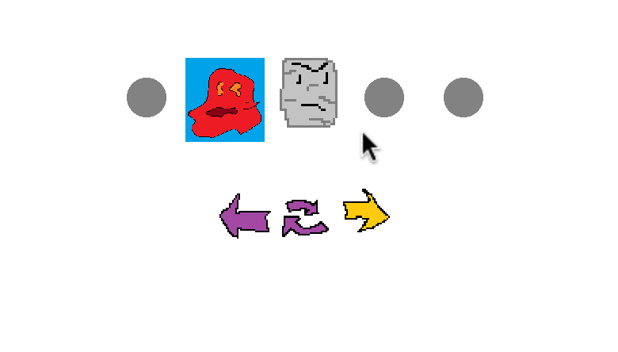
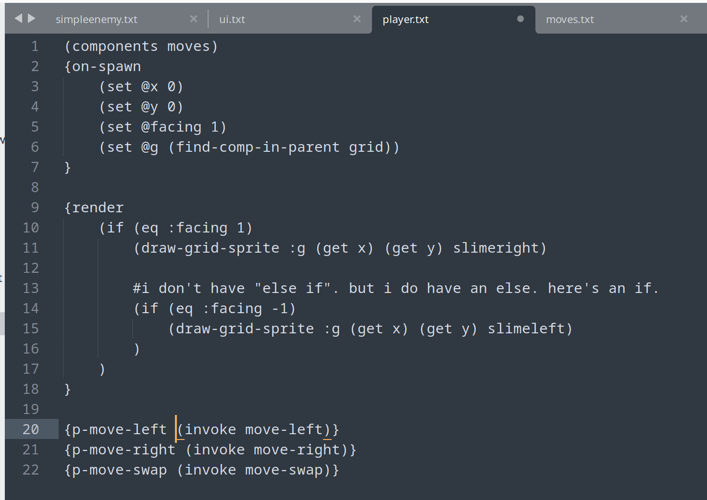
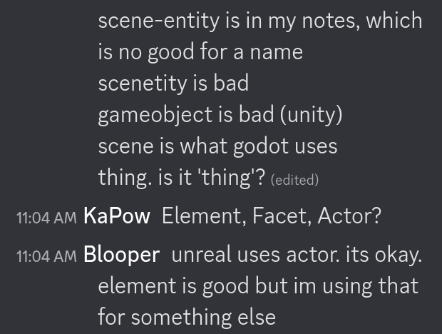
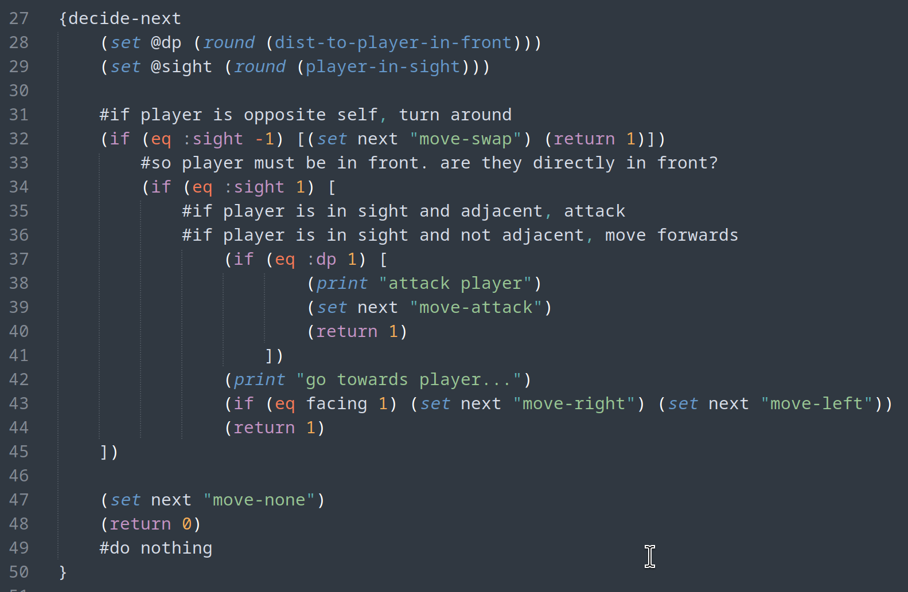
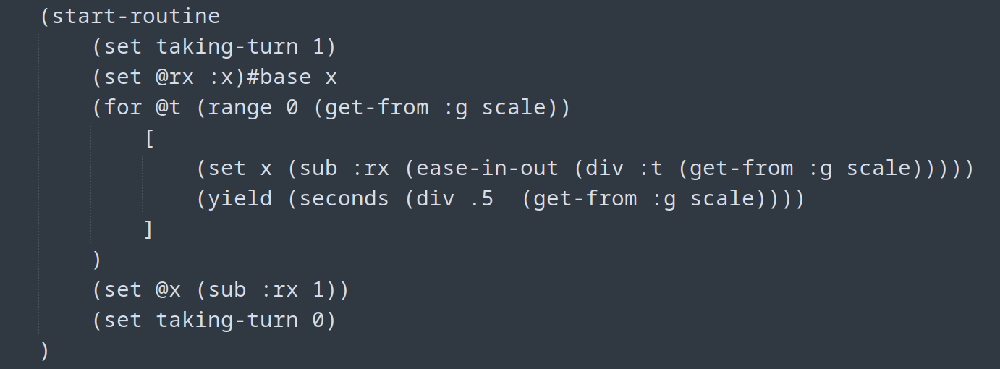

> A 7-day hackathon where you build a programming language and then make a game using it.

[langjamgamejam.com/](https://langjamgamejam.com/)

Did I succeed? Nope! [I didn't finish!](https://github.com/hunterdyar/LangJamGameJam25)

> I traveled for the holidays, finished making some rugs as gifts, and watched football with my family instead of going full hackathon. Sorry not sorry!

Despite not finishing, here's what I learned during the process.

*I gleefully embraced 'programmer art'*

---
## What Did I Make?
In C#, using RayLib, I wrote a game engine that loads a folder. Subfolders define types of logic (components, entities, sprites, etc). Each file is a script for the logic of that thing.

The scripting language is 'LISP-ey' with a handwritten lexer and parser, and a tree-walk interpreter.

[Project Code on Github](https://github.com/hunterdyar/LangJamGameJam25)

The game itself is insired by [Shogun Showdown](https://en.wikipedia.org/wiki/Shogun_Showdown) and [Hoplite](https://en.wikipedia.org/wiki/Hoplite_(video_game)), although I didn't get that far.

> Later, looking at what other participants did, lots of text-based games... I wish I had done that.

# What I Learned

## Without a Systems Diagram, At Least A Systems Decision Framework
For this project, I have to design and write:
- a language (and core library)
- a lexer/parser
- an interpreter
- a game engine (on top of [raylib](https://www.raylib.com/))
- the game itself

All in one project. Almost every feature could be implemented in multiple places. I needed to come up with some soft of **design framework** for deciding what systems goes where. 

*Where should this logic go?* This was the single question that permeated every stage of the project.

I didn't have a clear framework for "where things go". It would have been better to write up a systems diagram and hypothesize on a few features, thinking them through and deciding on some heuristics. One way would have been to write more speculative code of how it *should-or-could* work. With that, I could have saved full days of work. Instead, I found it in the process, which needed more rewrites than I had time for.

> To be fair, finding it in the process is still pretty fun.

I lost half a day re-working my component system to handle both the existing "components" and now "NativeComponents". I should have taken the L on native components (There is only one, "grid") and written the component in *the game* instead of *the engine*. Or hack it in as base function calls (in *the language*) without components at all. The difference at the end of the day may be nominal, but it just kept burning me.

## Features I Like:

#### Event Systems Over References
An Event System is great. I put it in the language. Being able to use 'invoke' (call functions on all children), 'broadcast' (invoke on root scene), and so on cleaned up the logic of my game a lot. So nice! Much of Unity Development is handling references, and anything to clean that up helps. 

#### Scenes In Scenes
What is a Scene? What is an Entity?

I spent half a getting rid of 'scenes' and 'entities' and making a 'thing', which I confusingly called 'scene'!

*The Programmers Challenge: Naming Things*

Scenes contain scenes contain scenes, like Godot. This structure ended up being **really nice** to work in.

####
Easing Functions should be included in languages/core libraries. Doing Native "ease-in, ease-out" functions was great. I loved doing this. Together with Yields (see below) I felt I had something quite comfortable to work in.

## Features that Burned Me

- Rendering was "immediate mode" style (draw calls in a render tick)... because I used Raylib as my backing system.
- Strings and function identifiers could be used interchangeably. Oops. In the interpreter it's dictionaries everywhere.
- The Call Stack (frames) and the Entity Stack (Scene Hierarchy) extended the same base class behind the scenes (RuntimeBase). I thought I was being very clever when I combined these concepts! Getting and setting variables? Right?... I was not it became a nightmare. So many bugs from this "clever" decision.

---
# So is the language good?
Uh. Well... Nehh?? It's nothing special.

I went for a LISP-ey *(parenthesis before the function name, not after)* scripting language. With some ideas about using the delimiters for a sort of type-sugar thing. `[a b]` would be shorthand for `(list a b)` and `~a~` would be shorthand for (cast-to-bool a), something like that.

Anyway, only `{func-name func}` for `(declare func-name (func))` happened. 

Would it be neat? No clue. The language syntax was fine. a LISP-like with some sugar; very easy to work with.

> This project has inspired my to give the [Janet](https://janet-lang.org/) language a good look. 

## Language Lessons Learned

### Error Reporting Matters. Obviously.
I didn't bother calculating line numbers, since I could debug in the interpreter anyway. Until I finally gave in, it took 2 minutes, and was extremely helpful to do. Give yourself the best errors you can! It's always worth it!

### Identifier Prefix Sugar 
To fix some bugs, I ended up implementing a hack that I like a lot! Prefixes on identifiers that determine how they are interpreted.

@ident declares identifier while :ident gets the value of it, and ident (no prefix) is a pointer.

> (for @k (range 10) (print :k))

For the *variable-here-being-declared-as k*, blah blah, print *the-value-of* k.

There's something about this that I like a lot, for code that explicitly makes it clear to the user how an identifier is being used, without extra keywords. When it's talking about it's declaration, it's value, it's memory-address/pointer, or what; you can read it. Nifty! 

> I don't have syntax highlighting (obviously). If I did, I would probably be less enamored by this. Variable prefix tools are something I'm exploring in pinch-lang.

*Example from the enemy script. Note the dp and sight local variables.*

## Don't rewrite your interpreter halfway through a project.
I burned it it down for yield statements

Putting async execution in my interpreter broke me, and broke the project.

> My tree-walk interpreter now is an enumerator that returns nullable YieldStatements as it runs. It works, it's effective, but the [overhead](https://github.com/hunterdyar/LangJamGameJam25/blob/master/LangJamGameJam/Interpreter/Interpreter.cs) became untenable. Nesting routines couldn't work.

The long version is, yields are really nice for game projects and handling animations, and I want them! I got them working enough, and it felt awesome to see the little character slide left and right. (Then I tried to do more, and it exploded).

"this happens, then this happens" - that "then" is really hard to actually program in games. I could have used a state machine or something and an if in a loop to monitor state and wait until things finished, but ... it's just so nice to be able to write a sequence of events out as a ... sequence of events. E.g. without having to conceptually map the overhead of handling it all.

In games, things often happen sequentially. Some sort of yield/async+sequential execution system natively included is just so perfect. 

So, blowing my project up for async routines was not worth it, but if I were to do it again, I would do routines again... just in mind from the beginning this time.

## Final Thoughts
This was a lot of fun. While I would do a lot different, I felt like I made **errors**, not **mistakes** - I had to go through this process to learn. I'm proud of even making anything half-working, and I look forward to trying again. 

 I'm excited to check out what [the community](https://itch.io/jam/langjamgamejam/entries) made. Some really cool and clever ideas here!