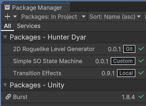
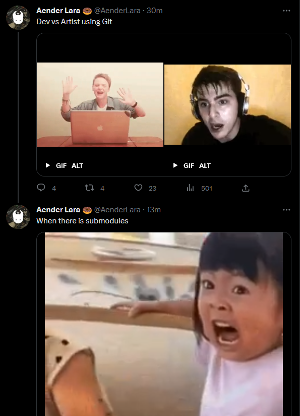

One important skillset to have in game & systems development is a modular approach. Basically, you build out your game systems in a robust and isolated way, such that you could re-use them throughout separate projects. This approach becomes more important the more you scale, and makes working with teams much easier. 

Check out the Unity 2022 talk [How to adopt a modular code workflow for your team](https://youtu.be/nk3gHIZZ5Rg?list=PLX2vGYjWbI0Qavt5La4C2xfILQKj8l8g5) for a broader overview and discussion. That talk also covers code & architecture strategies, which I don't discuss here. This blog post reviews my experience as a solo developer with the various implementation options for modular development that Unity offers. My packages are mostly focused on code, not assets, so I don't have the con of Git LFS or as many unity version/render pipeline annoyances to deal with.

*A package is structured and handled by Unity the same whether it is local outside of the project directory, local within the project directory (git submodule), or added through git.*

## Custom Asset Pack

Custom asset packs are tried and true. They are glorified .zip files with some assets in it, with some extra QoL features, like how if you delete part of an asset pack, you can re-import just that part.

>  After creating your assets in one unity project, simply export a .unitypackage and archive it somewhere accessible, like a NAS or FTP server; or for yourself. Use a file name convention for versioning.

Import as needed. Make changes and adjustments while working on a current project, and re-export/replace the package as you go, if making updates.

Pros: Simple, understandable, no software dependencies, no package setup. Export as-is at any point in time.
Cons: Version management, hard to make updates to one package from multiple projects.

## Custom Package - Local

Creating a [custom local package](https://docs.unity3d.com/Manual/CustomPackages.html) is very similar to an assetpack. With the assets, you also include a 'package.json' file that handles version numbers and so on. It's a little tedious to set up. Once done, it's far easy to deal with versions, and switch between versions. 

When you import the package, in the package manager GUI (add package from disk, then select the package.json file), it **won't** copy the assets over, but directly reference their location on disk. This solves the main challenge of the basic custom asset pack, since you can now upload one package and have them updated in all projects using that package. 

Pro: No need for LFS setup for handling large assets.

## Custom Package - Git

Instead of directly referencing a file location, you can add the package through git. The package repository can be local/networked, or through a service like GitHub.

Add by git URL. This is my favorite solution when you have a package that you don't update that often, and use in a lot of projects, like utilities scripts. I've used this for [transition effects](https://github.com/hunterdyar/Unity-Transition-Effects) and the like.

Pro: Part of the package cache. You can select a specific branch so you can make project-specific updates to the package without messing up other projects using the package.

Con: Updating the package. Often we add a feature or fix a bug specific to a project. Any changes you make to local files in the project will be lost, you have to go to a proper git clone of the asset and push changes to the remote, then go back to your project and pull the update. Luckily, you don't have to constantly increment the version number, you can just always hit 'update' in the package manger do a pull.

Con: LFS setup is annoying.

Git needs to be installed to add by git url, which means that **all team members will need git installed**, to resolve the packages, even if you are using a different system like perforce or plastic for version control.

> Technically, you can point to subfolders, instead of to whole repositories. One repository can have multiple packages. How to do this is described [on this manual page](https://docs.unity3d.com/Manual/upm-git.html). I don't recommend this approach, but it's good to know it's possible. 

## Custom Package - Git Submodule

Instead of adding the package by a git url, you skip the package manager, and add a git [submodule](https://www.atlassian.com/git/tutorials/git-submodule) to your 'Packages' folder.

Pro: You can edit the files and manage it as a 'proper' remote package. 
Pro: You can use multiple branches to keep project-unique changes separate, before (perhaps) safely merging.

Con: You must use git for your project in order to use a submodule.

Con: Git submodules are very annoying, and can cause plenty of git headaches. *(Note: I like [Fork](https://git-fork.com/), a git UI that makes some of the more tedious git things, like rebasing or submodules, much easier).* 

First, set up the package just like the above, as a proper unity package and host it on github, or whatever git remote you are using. You **could** add the asset by git url in the package manager at this point. 

Now, go to git and add a git submodule with the remote url, to a "Packages/com.package.packagename/" folder.

From Unity's point of view, this is an [embedded package](https://docs.unity3d.com/Manual/CustomPackages.html#EmbedMe). It will see it, locally, and display it in the package manager just as if it were added by git url.

> The key difference is that you can make changes to the local project files, then go into the submodule and commit/push those changes to the packages remote, and go back to your project and commit and push it's separate changes there.

You can set up multiple packages as submodules.

## Symbolic Links

I did not explore using Symlinks to configure local packages, as none of the developers or students I work with are familiar with symlinks, so there is an overhead with explaining it to them. There is increased setup overhead for the advantage of trivially easy package updating. One would still need to explore how well it integrates with other forms of version control.

If I did have to use Symlinks, I would start with a tool like [Package Symlinker](https://github.com/codewriter-packages/Package-Symlinker) to make configuration simpler.  

# Conclusion

There are many advantages to modular development that make the configuration threshold worthwhile. For example, my entire journey into modular development started not when working on a team, but when I learned about how [Assembly Definitions](https://docs.unity3d.com/Manual/ScriptCompilationAssemblyDefinitionFiles.html) could speed up the Unity Editor. (There is less code that needs to be recompiled every time.)

Because of how I work as a solo developer, my packages have had the following stages:

1. Make a thing for a project. Start thinking/writing it in a modular way, and use namespaces & assembly definitions to enforce it when ready.
2. During a second project, it still probably needs a lot of updates. Now I pull it from the old project and turn it into it's own repo. A git submodule is easiest for me to work this way.
3. Once the frequency of needed updates goes down, for future projects add, simply use as a regular through git package.

Learning the approaches and programming strategies for being *able* to work modularly ends up being a huge workflow benefit, and I believe far outweighs the costs in most cases. This is my perspective as a largely solo developer. I don't often end up even publishing or re-using my packages, but just by developing with the goal of "this could be a package" modularity, code problems remain isolated and easier to debug.

