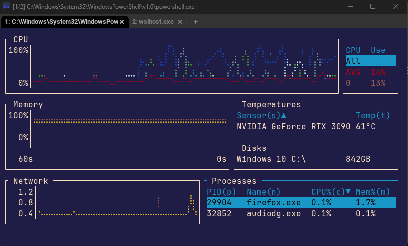
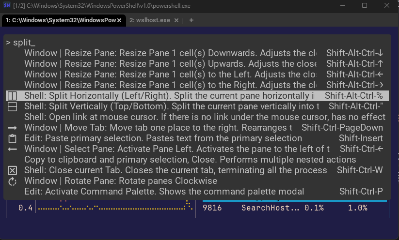

Working in the terminal has long been the domain of computer power users, but why? It's confusing, and intimidating to be sure. Understanding how to effectively work on the command line involves working with a weird and wide set of odd commands and mystic incantations.

It's inaccessible!
- No visual representation of the state of the computer system.
- Have to memorize commands to operate. No discoverable UI.
- Small changes can lead to unexpected and disastrous outcomes. No safety net.

So, how can we make the terminal more accessible?

The first method involves changing the way you think about software. In the world of GUI, you have massive monolithic tools that you live inside of. Photoshop, video editors, 3D modeling, excel. You have one tool that does everything, and you learn it.

These tools save files in non-interoperable ways, and are the only workflow for dealing with the information. 

On ther terminal, things are different. Commands, software, and tools are all largely disconnected from the data that they operate on. You might use a number of tools to create a document, analyze it, move it around, and convert it to another form.

This exaserbates a certain problem: the need for memorization. There is nothing telling you which tool to use to validate a JSON file or move a document. Googleing the problem is unhelpful because there are many, many possible and correct answers, and they may not apply to your termianl.

This blog post is about tackling just one problem with terminals: discoverable UI.

## The Terminal on Easy Mode
Instead of [cheatsheets](https://github.com/RehanSaeed/Bash-Cheat-Sheet) or [guides](https://zsh.sourceforge.io/Guide/zshguide01.html#l1), what if we could maximize the amount of information the command prompt presented to you that was about the available choices you can do?

Then, you can still *mostly* focus on the task at hand (what makes working in the terminal comfortable and fun - it's simplicity) while not having to memorize or reference commands.

After some research, I am presenting you a set of terminal commands and software that give you the power of a linux elder without the hassle of years of practice. More like... a half-hour of practice.

---

I present: The no-memorization terminal.

## Objectives For a No-Memorization Terminal
### Open-source and activly used  tools
No matter how good the tool is, we want to be able to use it in a year. Or two-years from now. Terminal software need not be updated as often as GUI's. That's the joy of terminal commands: They don't tend to break when windows puts out an update. So the active community is more about being able to find support and resources for the tool than worrying about if it will stop working one day.

Open-Source is a requirement because we want the tools to continue existing when it's current maintainers move on to something else.

### Cross-Platform
It would be good to work consistently when switching between machines. There will still, sadly, be *some* memorization. So cross-platform support aleviates things working differently in different places.

### Minimal configuration, reasonable defauts
One of the best features of terminal tools is that they generally extremely customizable. That also makes them annoying, as many tools assume you will change the configs and give you a bare starting point. We want to install a tool and move on with our lives. It should be *just fine* out of the box.

### Configurable, nevertheless
Despite what I just said about reasonable defaults, the software should still be highly and easily customizable, with external and machine-independent config files we can backup and transfer.

### Disocverable User-Interfaces
Minimize the actual memorization! Well supported projects that tell me available verbs on-screen, and allow me to search or auto-complete commands. This is the easy-mode of a no-memorization terminal.

### Built-In Help
A useful man page, up-to-date documentation, and - ideally - in-tool support are all desired. Software built for it's users, not just for it's developers.

### Predictable
Software with a lot of state-dependend commands or a lot of specific-sequence commands is no preferred. We want to basically be able to do anything at any time, and know what will happen when we do.

### Installable via Package Manager
I want install - and more importantly, updates - just handled for me without having to think about it too much.

# As Close as I can Get
First, a disclaimer:
1. I failed. My objectives set above were too much for the terminal gods. My attempt here to get close is annoying to install/setup, and it is not cross-platform. On Windows I have been using [Windows Subsystem for Linux](https://learn.microsoft.com/en-us/windows/wsl/) as a workaround. It works.... 
2. This is evolving
3. This is just one way to do things, and more an exercise in design considerations than a way you should set your machine up. That said, whether you are new to the terminal or experienced, try these tools! You might just like having less to think about while you work.

## The Terminal Emulator
### WezTerm 
WezTerm is a powerful and fast GPU-accelerated terminal emulator that is cross-platform. It features a command-pallette. Simple press ctrl+shift+p and then start typing to try and get to any of the commands and options you want. 

### Honerable Mentions
Alaccrity is similarly fast and cross platform, but that command-pallette as a way to avoid memorizing keyboard shortcuts puts wezterm over the top for me.

For emulators, this is where you have the most flexibility if you don't care about cross-platform support. For example, Terminal, on windows 11 by default, is pretty good! It has multiplexing and an easy profile setup system.

## The Shell
### Fish
Sadly, fish is not cross-platform. It can be run in windows through mysys or wsl. I've been using WSL, and... bleh, but it's fine. It's command system also isn't cut-and-paste compatable with bash, so one has to re-write scripts sometimes. In my experience, it hasn't been a big deal.

You don't have to think about capitalization either, no matter what OS you are on.

Now for the big-sell: sophisticated auto-complete. 

Like all good shells, if you press tab, you can quickly auto-complete a file or directory. Fish goes further. If it's ambiguous which thing to complete, it will show you a list of available options you can choose between with arrow keys.

You can also auto-complete for command options. It generates these from the built-in documentation all tools provide, so it always has accurate and up-to-date suggestions for using any tool - and it shows them to you in a list to choose from. That's exactly what we want!

### Honerable Mention
#### Windows Powershell 7
No, seriously. Powershell is cross-platform (yes, really), and has a long-supported plugin system. It has autocompletes that are not as friendly as Fish, see setup notes, and it allows for familiar bash (otherwise universal) navigation commands. All of that is on top of the real reason powershell exists, which is automation and scripting.
Powershell 5.1 comes on your computer by default. The new version you have to go install. Now you have two powershells. Yeah, Microsoft made something good but then went and microsoft'd all over everything again.

#### XONSH
Xonsh (like nushell and powershell), is about scripting. But instead of rolling it's own scripting language, it uses python. If you already know python, xonsh may be friendly and predictable for you.

#### No love for Zsh?
While I don't think Zsh wins any awards for discoverability or user friendlyness, it sure is popular. That's a good thing. There's a tool called 'oh my zsh' that allows easy setup and configuration. Being popular means you can google for problems, but it's not cross-platform with windows, and not really discoverable. 
It is, however, the default shell on mac, and it's totally fine. 

## The Window Manager

### Zellij
[Zellij](https://zellij.dev) is a workspace "with batteries included", which is the phrase we are looking for to mean we don't have to go searching for plugins or deep configuration.

Zellij is *not* cross-platform, only mac and linux. Like fish, Windows users can use it in WSL.

Unlike other solutions (read: screen or tmux), zellij doesn't care about maximizing your screen real estate. It shows nice clear borders around each tab that highlight to let you know which one is active. At the top is a tab bar with, again, clear highlighting.
 At the bottom is a status-bar that tells you what keyboard shortcuts will do what. That's what we love about it!

Of course, you can turn these all off easily. But the default setup gives you a no-memorization way to manage your tabs and window layout, and a session-manager. It has a nice 'floating' window feature too, nice for doing something quick without messing up a layout.

You will probably create the same layout many times, and zellij has you covered there too. You can create layout files that will instantly get you setup and running. Neat! That sounds like too much configuration for me, though. I'll do it, uh, later.

### Honerable Mentions
#### Your Operating System
Stricly speaking, you don't need a window manager. Rather, you already have one!

If you are on windows, you might instead choose to just open another **window**. You know, that thing that *windows* is really good at handling? It's right there in the name!

#### Your Terminal Emulator (Windows Terminal, WezTerm, Konsole, etc)  
WezTerm is on the list again! You can handle splitting panes and tabs right inside wezterm, and use the command-palette as a nearly-memorized-shortcut-free way to get there. It's totally fine!

Other terminal emulators have panes and tabs too, but may require learning keyboard shortcuts. 

Windows Terminal has very good mouse-support but... but if we have to right click with a mouse, what are we even doing in the terminal in the first place?

One positive to not using separate manager/multiplexer software is that it's less likely your keyboard shortcuts will conflict with each other.
## File Manager
One thing that constantly makes me uncomfortable on Windows or Mac is organizing or finding files. Opening new floating windows and running throught the same list of clicking around. I've memorized all sorts of shortcuts to speed this up.

The terminal *should* be faster at this, but the default way of moving around the terminal (which, sadly, we should memorize: cd, ls, cd ../, ls again...) can be slow, since we constantly want to double-check our current location and state.

Enter a terminal file manager tool. We have two goals: moving around quickly, and managing files. 

## File Navigation
### Broot

### Z

## File Manager
?

# Part 2: Less General Tools
Now that we can open and move around a workspace... how do we do anything?

- A Fuzzy Finder - fzf
- The Fuck
- Wat
- s or z

## What about text editors?
In our ethos, nano is king. But micro is like it, but... with colors and features.

For the real-deal modal terminal text editing, Helix I think beats vim for no-memorization usability. Perfectly reasonable defaults (except the theme), and after the basic (shit, sorry), you can see command by tapping certain prompt keys, like space.  Other commands have a tab-throughable popup. 

For programming languages, just install a language server in your path. Done! No config!
I'm writing this in helix right now!

You can get to the same place with neovim and a million plugins, which has the advantage of being the most popular terminal text editor... but it's a lot to learn, and a lot of configuration to get it to a less-memorization and easy to use place.
