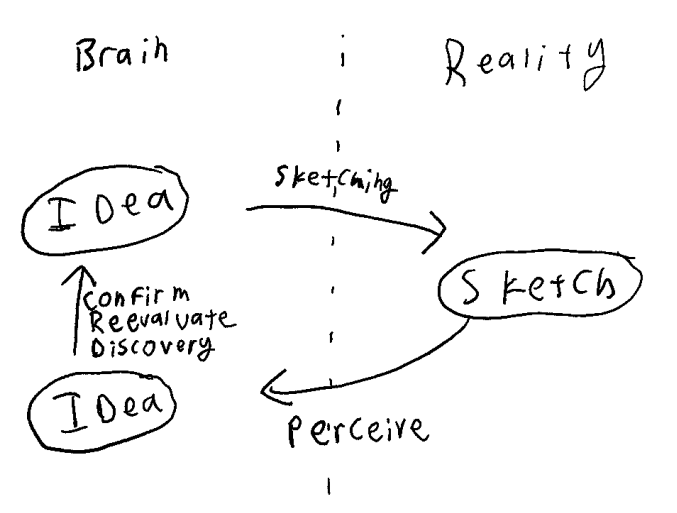

## What is a Sketch?
Ideas are not real and communicable until we attempt to externalize them. A sketch is the lowest fidelity attempt to realize an idea.

## Externalization of an Idea
Sketches turn ideas into things that must be sensed or experienced, which we then interpret back into ideas.

## What do we Gain from Externalizing?
Looking at the difference between the idea that we perceive, and our original idea, we find the value of a sketch.
- We can confirm (or not) that what we thought would work.
- We can discover new avenues or lateral connections.
- You do not need to start with a complete idea. You can start with almost nothing, a single line, a prompt, or random noise.

## Empathy as a Viewer
It is the minimum required effort required to empathize with the viewer/user. We want to know what our creation will be like when it’s not in our heads, but alone. 

We become the viewer (or user, or player) who cannot merely *know* an idea, but must *perceive*, *interpret*, and *experience* the sketch to turn it into an idea. 

It can be said that sketching turns us from creator into an audience member, but we throughout the process we end up with a foot in both pairs of shoes, creating and experiencing and analyzing all at the same time, as we engage with the feedback loops of the creative process.

## Two Approaches To Sketching
The gap between the idea we start with, and the idea we end up with is where the magic of creativity happens. Inevitably, there will be a difference between them. We can move in two directions:

1.	We can iterate to make the idea we are sketching more like the idea in our head: Refine, Shape, Form
2.	We can iterate to make the idea in our head more like the idea we are sketching: Follow a Lead, Discover, Chase Inspiration.

An effective creative process will never do just one or the other approach. Sticking to a vision you can’t make a reality is frustrating and repetitive. Following miscellaneous creative leads will leave you unable to reach a desired destination.

It’s important to know what you are trying to do. Analyze your own creative sketching process and be aware which approach is happening at any point in time. If you're stuck, change your approach.

## Sketching & Iteration
I recommend the following iterative approach to sketching:
1.	Start with some prompt and follow your leads
2.	Refine the idea down into something specific
3.	Start a new sketch chasing one of the ideas you didn’t follow before, while refining.
4.	Refine this new idea down into something specific
5.	Repeat

Basically, you are following the process starting with approach two, refining into approach one. You are repeating this pattern on a micro single-sketch scale, and executing the same kind of follow-leads-then-refine process throughout a macro multi-sketch process.

## Visualization
The ability to have an (internal) idea that accurately reflects its (external) form is a skill photographers call ‘visualization’. Visualization is something that comes with experience and practice, but it’s important to know that it does not let us bypass the sketching process. Rather, it allows us to prioritize our efforts on playing with the interesting, curious, and unknown. With visualization, we should be spending *more* time chasing creative leads, not less. 

Visualization can be a trap. Too convinced of our predictions, we end up not discovering new directions or opportunities. Sketching less, we never bothered to externalize the idea in the first place. This trap happens not because one just isn't good enough at visualization, it’s that if one is confident they know what they are going to get from a sketch, then they are not sketching effectively.

## Enforcing Discovery
As with the trap of visualization, discovery too can have a trap. We get stuck following the same leads, making the same changes, and repeating. If we start from the same place, at about the same place in time, in the same mental state, and are using the same process, why wouldn’t we end up in the same place? So how do we discover new threads? Where does inspiration come from?

We can enforce our ability to discover creative leads in a few ways.

### Sketch bad ideas anyway
The idea isn’t the point, but the discovery of something interesting about it is. Bad ideas executed are incredibly useful to learn from.
    
### Turn An Early Creative Decision Around
After we have finished an idea, go back to one of the initial decisions/assumptions and invert or change it radically. For example, after setting up the lighting, pose, and everything else of a photo, I often then “turn around”, and take a photo in the complete opposite direction. The lighting of the scene is completely different, but much of the other decisions I made with the original lighting in mind remain. I find new patterns and discoveries in this space.

### Read
- Want to be a great writer? Read. A great photographer? Take photos. A great painter? Look at paintings. 
- Duh... but seriously. Make time.
- Attempt to reverse engineer some of the decisions or patterns at play, add them these your bag of tricks.
- Mimicry, Theft, and Copying is useful. Follow the creative steps of another, and try to imagine what decisions got them there. These decisions are what you will carry forward for your own creative process (not the stolen work).

### Show the Sketch to Others
- For obvious reasons. Get feedback!
- For non-obvious reasons, unexpected observations and lateral connections (“this reminds me of...”) can often surprise you in effective creative ways.

### Think Differently
- Become someone new: Take a break. Consume new media. Read. Talk to people. Sleep. Drink some coffee. Listen to new music.
- Force a perspective change: Stand up, back up, flip the idea around. Literally flip the piece of paper around. Stand on your head. Zoom in. Zoom out. Change to black and white. Rotate the monitor. 

### Do the Same Idea Again
- Start from the same place, but don’t make the same adjustments you did previously.
- Follow your “second” instinct. Chase an alternative solution, with your initial solution disallowed.
- It can be counterintuitive that one of the best ways to get our of a repetative rut is to repeat oneself. Instead of different starting places to the same result, start at the same starting place - from here it's easier to force yourself to end up at a different result.
