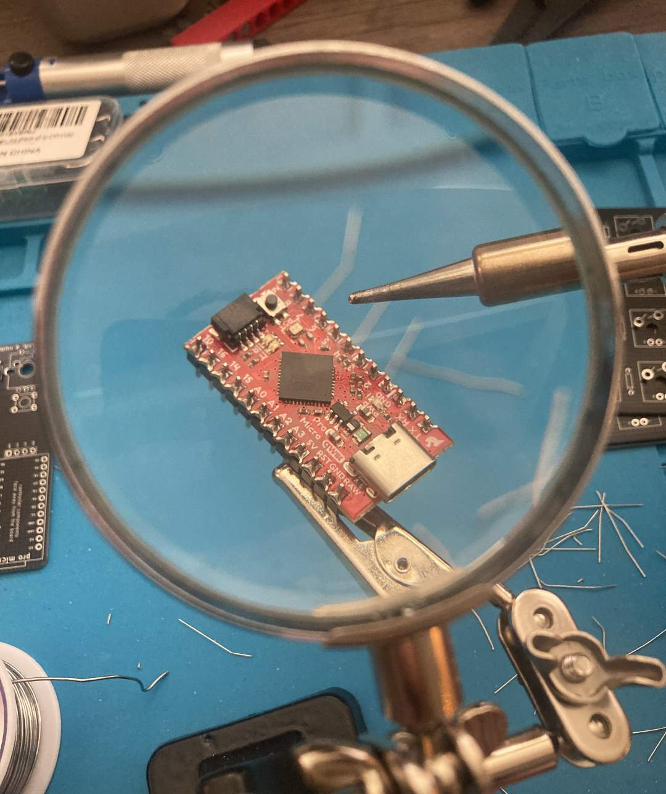

I've always wanted a numberpad that's also a calculator. It's a pretty simple concept! How many different grids-of-numbers do I need sitting on my desk? Why do I need to open the calculator app on my computer? It should just... be a calculator. And a number pad. It should be both!

Well, this device doesn't exist, so I went ahead and made it.


## Designing the PCB

The first step to building a completely custom keyboard from scratch is designing and ordering the PCB. In this world, I have no experience. But luckily, I don't need any! There's a massive community of keyboard and computer peripheral hacking enthusiasts. Many of these kind souls put all their work on the internet, completely open-source. This project is a glorified hack of other people's projects. I stand on the shoulders of nerdy giants.

I started with the [Dumbpad](https://github.com/imchipwood/dumbpad), originally by imchipwood. I used the "[combo_oled](https://github.com/imchipwood/dumbpad/tree/master/combo_oled)" version, designed by [KEEBD](https://keebd.com/). With the schematics in hand, I got editing.

Naturally, I didn't *have* to edit the PCB's. The open source project includes the "gerber" files that you send to the manufacturer. I installed both [KiCad](https://www.kicad.org/) and [Fusion 360](https://www.autodesk.com/products/fusion-360/), but my edits were so simple, I just stuck with KiCad. Found the silkscreen layer, and changed some of the texts to silly jokes. This was important to me.


*It was for this dumb joke that I risked ordering broken parts due to incorrect PCB settings.*

In terms of *actual, functional, design* I made zero changes. But I did now need to re-export the gerber files to send to the manufacturer.

## Ordering The Parts

The electronics parts were easy to order. Bulk diodes and switches, and a few off-brand arduino pro micros. To make the costs make any sense, I basically *had* to buy enough to assemble at least 3 or 4 or these things. The biggest challenge is the PCB. I ordered mine from [JLCPCB](https://jlcpcb.com/), because they had a various coupons for first orders. I managed to order 5 pcb's for a grant total of $2 with $9.64 shipping. This felt like I was getting away with theft. But, to be fair to them, I am extremely inspired to do more of these projects.


Of course, they emailed me a day later telling me I forgot to include the drill files, so I had to re-export and **actually pay attention to the settings** this time. Then they emailed me asking for some clarifying questions about what does and doesn't need to be plated or drilled. I quickly had to learn the answers. All the holes they had questions about ended up being mounting holes for the switches, and plating or no plating didn't matter for me either way. Still, I did *something* wrong exporting the PCB's, so I'll recommend anyone wanting to do this project to either a) learn more about how PCB design works or b) use the provided gerber files from the dumbpad repository.

## Soldering

Once all the parts arrived, I had to solder it together. For the most part, this was pretty easy as far as soldering goes. No surface mounted components and a clearly labeled silkscreen.

 

*I bought one nicer pro micro with USB-C that I wanted to be my "good one", and a few cheaper off-brand ones with micro-b.* 


*No LED's for me, that sounds like too much work.*

## Soldering Challenges

The biggest challenge was my switches. The design just has the switches just resting on the PCB, and soldering right into the oversized mounting holes. Other options include using [Hot-swappable sockets](https://www.amazon.com/Hot-swappable-Socket-CPG151101S11-Mechanical-Keyboard/dp/B07K8CCMQZ), which would be something I would consider for future builds. The switches can snap into a frame, but who has time for that? I'm letting the pin connection hold all the tension. It's fine! It's probably fine! 

For switches, [TTC Bluish White](https://cannonkeys.com/products/ttc-bluish-white-tactile-switch) switches. To be honest, I'm just using the ones I have around. They're all basically intercompatible. I used these switches for a recent desktop keyboard, and planned ahead to buy extras.

> I didn't actually plan ahead to buy extras. I bought too few originally (having forgotten about the f-row). I needed a handful of switches, but chose to buy 100 more and use them for future projects. Like this one! So it all worked out.

If I were to do it again, I would defintely solder [Female Headers](https://www.sparkfun.com/products/115) to the board for the Arduino, so I could replace it later without desoldering.

### Soldering the Switches

In one of the above images, you can see I soldered the potentiometer on before the switches. This was a mistake, as it made laying the board flat + face-down much more difficult. The switches were a nightmare to solder. Basically, there's just a **ton** of wiggle room, so they're hard to get aligned.

Eventually, I found the following workflow: 

1. I would solder just one of the pins, using the minimum amount of solder. (I would do this for a row at a time).
2. I would prop the board up vertically in my helping-hands, and heat the connection up with the iron until the solder melted again. 
3. My other hand would hold the switch, and while the solder was melted, I would push and wiggle it aligned with the silkscreen, best I could. 
4. Release the iron, the solder cools and hardens. (I did that for the entire board, then re-did the few that were still out of alignment)
5. Finally, I soldered the other pin for all switches.
6. With the other pin securing the switches, I re-soldered, properly, the first pins.

I do not think this would be a very convenient workflow on a full-sized keyboard, and I will plan to use a plate for switches to snap into on future projects. 

## Bootloading Pain

The Arduino's I'm using can all behave like regular USB devices - you know, like a keyboard. In order to pull this off, they have to switch into and out of "bootloader" mode. In this mode, it behaves like a normal arduino device, and can be flashed with new firmware. The other mode is just a standard HID. Operating and read like a USB keyboard, unable to be flashed.

First, I had to get my Arduino IDE [setup](https://learn.sparkfun.com/tutorials/pro-micro--fio-v3-hookup-guide), thinking I would be writing the firmware myself. Ultimately, I went a different route, modifying [QMK Firmware](https://qmk.fm/).

> In QMK, there is an ability to switch to [bootloader mode](https://github.com/qmk/qmk_firmware/blob/master/docs/feature_bootmagic.md) with some special key entry. I would seriously consider implementing this in future projects.

The [SparkFun](https://www.sparkfun.com/products/12587) device has an [awful little feature](https://cdn.sparkfun.com/datasheets/Dev/Arduino/Boards/32U4Note.pdf), where you have to double-tap the reset button, then flash the firmware during an 8 second window. Unfortunately, it takes my computer longer than 8 seconds to flash the device. There's a certain magic spell where you can put it into bootloader mode, then start flashing so the Arduino IDE doesn't abandon the attempt, then it leaves bootloader mode and you quickly double-tap reset to put it back in again at just the right moment to have the thing upload.

> I spent  a day being frustrated by this, listening to an opera of the USB connect and disconnect noises on repeat.

In my frustration, I tried a workaround where I grabbed the [.hex](https://www.engineersgarage.com/hex-file-format/) file directly from the arduino temp folder and tried to flash that using a third-party microcontroller flashing tool, [QMK Toolbox](https://github.com/qmk/qmk_toolbox). Here, I managed to do something to only partway flash the device, and I bricked the arduino. Oops!

So I wasted half of a day trying to rescue the thing. One approach is to use another arduino that I apparently had lying around as an intermediary ISP and flashing it that way. (While I have an [EEPROM Programmer](https://eater.net/shop) from a different project, I can't be bothered to de-solder the arduino).


*Failed Arduino brain surgery.*

Ultimately I decided to put the entire bricked board to the side, and just continue on with my working one, which is the same except for being micro-usb and having different bootloader firmware. This one automatically goes into bootloader mode when it's turned on, and then an 8 second or so timeout until it reverts. It's also annoying to work with, but with the auto-flash ability of QMK Toolbox, I was able to consistently update it.

> Don't have an extra arduino lying around? If you've read this far into this blog post, I'm willing to bet that yes you do. 

## Building The Case

No thanks!

> Once I get my hands on a 3D printer that somebody other than me maintains, I'll put together a case for the thing. I don't care about the aesthetics, but I do want to set it on metal surface and **not** have it short out in a disspointing puff of failure.

## Writing The Firmware

At first, I assumed it would be easier for me to add keyboard features in arduino. I was confident I could talk to the OLED Screen and write a calculator app in the Arduino world. I was wrong, mostly due to how challenging it was to flash the device and test things. I never really got to reading inputs properly with the internal pullup, and some of the Arduino libraries seemed out of date.

Thanks to my experience programming the Swadge, and on my background of C#, I am more comfortable in the C/C++ world of QMK than the [circuitpython](https://github.com/adafruit/circuitpython) world of [KMK](https://github.com/KMKfw/kmk_firmware). I'm creating hex files! 

> CircuitPython alos just feels wrong to me. I can't justify this feeling, and won't pretend I care about the performance overhead, and I love the educational initive and increased accessibility for microcontroller projects. But, personally, conceptually, I want to use the right tool for the right job. Shoving python on a microcontroller feels hacky. Almost as hacky as putting javscript on a microcontroller! Wait, people are [doing that]](https://www.espruino.com/) too?  

It turned out to be way easier to just [fork QMK Firmware](https://github.com/hunterdyar/qmk_firmware). I spent a while being confused, as I poked around in the project. Then I remembered that large, community driven, open source projects tend to have documentation. QMK has a page called '[Understanding QMK's Code](https://docs.qmk.fm/#/understanding_qmk?id=understanding-qmk39s-code)', and after the arduous task of reading the docs, I was in business. 

I copied the existing combo_oled firmware to my own setup, then started hacking away.


*Yep. That's a calculator.*

The environment workflow is simple:

1.  Write the code. Taking advantage of overriding a few important functions, like "oled_task_user" for draw code and "process_record_user" for grabbing input. That function, you can return true or false if you want the keyboard to continue processing, so I was able to easily add a toggle to turn the numberpad on and off, so you can calculate at will without entering random numeric gibberish into the code file and causing compile errors. Which I also did. A lot. 
2. Compile using the QMK MYSYS app. I am annoyed that it installed itself just right into my root "C:/" directory. "C:/QMK_MYSYS/". Who does that? I have a tools folder that has other MYSYS versions I've needed for other projects, but yeah. Sure. 3.5 gigs of files in my root directory, why not. :(
3. Flash using QMK Toolkbox. With Auto flash enabled, I just had to press the reset button with a certain magically timed ("press, wait, wait, press, press") spacing to get it to consitently flash. It didn't flash often enough that I had to have the app visible on a second monitor to check if my changes actually got uploaded before testing. *Note: You also want to double check the right chip is selected in the top right. Easy to miss that.*
4. Distantly consider if CircuitPython isn't such a wild idea while waiting for progress bars.

## Miscellaneous Code Challenges & Some Solutions

- Rotating the screen. Turns out, while it's [supported](https://docs.qmk.fm/#/feature_oled_driver?id=_90-degree-rotation-technical-mumbo-jumbo) by QMK, it's a software hack. It seems to break on me when I used the **oled_set_cursor** function, so after a few hours of getting nowhere, I just wrote my way around the issue and didn't use that feature. It made the drawing code quite the headache.
- Decimals. The **snprintf** function only returned a ? when working with doubles. Best I can tell, this is because there is some underlying math library that's not being included in the QMK Firmware. Probably for reasonable purposes - it's keyboard firmware. But troubleshooting it was rather annoying, and I eventually asked an expert, Adam, who leads the [Swadge](https://github.com/AEFeinstein/Super-2023-Swadge-HW) project, and they confirmed that, yes, "sometimes it be like that". I wrote my own print double function in fars less time then all the research and frustration took from me. 
- Constantly having errant numbers in the code causing compiler errors. Because the calculator is, you know, also a functional numpad, I kept typing them in!
- Adding a custom keycode to QMK to, when you push down on the potentiometer/switch, toggles the keypad functionality on and off. You declare the keycode once, in a header file. and reference that in the keymaps.c file. The SAFE_RANGE is a macro that will, when compiled, be turned into some usable unique value. No guesswork, and no taking over some hopefull-unused key. 

```C
//.h keyboard file
enum calc_keycodes {
  CALC_TOGGLE_PAD = SAFE_RANGE,
};
```


- You can't really type negative values... so if you press "-" it will chain the minus operation as if you had entered the value (which is 0) and you get to the same destination.
- No Debugger. Gosh, I miss having a proper debugger. At least while writing code for a microcontroller, the lack of an interactive debugger is, I suppose, justified. It ended up being valuble to do the oled drawing code. After that was in place, it became much easier to use it to report back information and debeug things, and development sped up considerably. If I were to go back, I would do the drawing code first, or have the keyboard *literally type* some feedback for me.
- Decimal Entry. I had the whole thing working with integers, and then went "wait, I think I'm forgetting something important about the nature of arithmetic"

```c
void enterNumber(int num)
{
    //enter in the 1s place, shift everything else left.
    if(placeEntry == 0){
        buffB = ((buffB)*10) + num;
    }else{
        //enter the tenths/thousandths place, etc. (when placeEntry is 1, this will be buffB+=num/10. When 2, b+=num/100, etc.
        buffB = (buffB) + (num * (1/(pow(10,placeEntry))));
        placeEntry++;
    }
}
```

- Don't call "oled_clear()" in "oled_task_user()". It just breaks things.
- In general, writing the calculator software felt like taking a programming quiz for a 101 course in C. In other words, whenever I messed something up, I felt *particularly* stupid.
- What happens when numbers go out of range and it turns to gibberish? For now: Nothing! You discovered the *forbidden numbers*.

---

# Conclusion

The keyboard firmware that I wrote for this project currently lives [here](https://github.com/hunterdyar/qmk_firmware/tree/dumbpad_oled_calc/keyboards/dumbpad/v1x_oled_calc).

I have unleashed the power of "Screw it, I'll do it myself", and now feel all the more inspired to work on more electronics projects. My whole family will be receiving unwanted keyboards for christmas next year - but with bespoke charm!

For this keyboard, I plan on adding a binary/hex/decimal converter mode to the calculator, then work on designing a keyboard that's actually from scratch, doing a PCB layout myself, and actually bothering to print the enclosure.

Ultimately, this was an extremely rewarding and educational project, and there was no single part of it that was too steep of a learning curve. All of the places I got stuck were arbitrary quirks, or silly things like when I simply missed one of the diodes. The mechanical keyboard community is large and welcoming, with tons of open source projects and online guides. Keyboards feel like the perfect entry point into custom electronics or PCB design, and are rewarding projects in their own right. 

 
