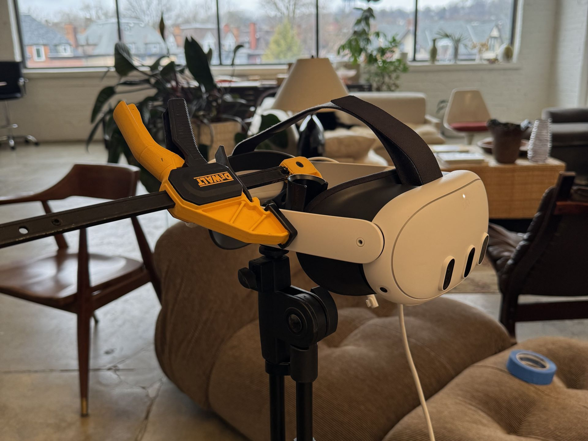

A few days ago, [Starship Home](https://www.meta.com/experiences/starship-home/5959677854068956/) by [Creature](https://www.creature.page/) released. The game is great! Go buy it!

I was grateful enough to get to help film some of the trailers for the game for Creature. First, we filmed the teaser trailer.



Shotlist in hand, we just worked through it all laboriously. My primary skill I brought to the table was patience and pickiness. It took forever, we wanted to stop and say "good enough" the entire time. My job was to fight that urge, stay picky; and handle all of the administrative and logistics so Doug can stay focused on his performance.

*Quest 3's do not have tripod mounts. But a lightstand, a clamp and a small bit of tape to cover the face-detection sensor serve well enough.*

I have years of experience as a professional photographer and working in VR, so I am already primed to tackle this work thanks to my experience and skill set.
Yet, unexpectedly, one of the most helpful things I brought to the table was years of analog photography! 

Okay, really, I mean visualization - a fine-tuned ability to predict how an image will look after capturing it, without needing to preview it. There was no way to preview the in-headset capture from the computer, and no ability for the person in the headset to understand the frame that was being captured - which is much higher up then one would naturally think or look towards.

Even so, it was a long day of filming.
[Doug](https://dougnorthcook.com/), who performed/filmed the capture, had quite the sore back and legs after a full day of crouching, leaning, lurching, and sliding around; arms held at awkward angles (that looked like natural angles).

---

A few months later, I returned to help film the launch trailer. We did a test day to run through the production workflow, and to test potential [new workflows](https://x.com/tovanbo/status/1807781662509371831?lang=en). 



This was filmed with the help of two of my Immersive Media students. Evan Alexander, who appears in the trailer, and Daniel Bartell; who served as my assistant (the "Capture Station Commander and Good Filename Guru").

Between filming the teaser and now, Meta's internal team added a lot of helpful features to the Meta Quest Developer Hub, including wireless developer bridge, and - most importantly - a realtime preview of the video capture.
Everything got much, much easier - with a faster feedback loop, the process became smoother and quicker. 

Screenshots or exerpts of both the teaser and trailer have been used by [media outlets](https://www.roadtovr.com/starship-home-review-quest-3-mixed-reality/). It was also seen Unity Unite during the [Keynote (Unity Sizzle)](https://youtu.be/MbRpch5x4dM?t=2022), and on loop on a TV in the demo area. Neat!

So often in my field, I am stepping into the unknown. My skillset is broadly, the ability to do that: problem solving. For this project, filming a VR Trailer, I was - for once - entirely in my comfort zone. 

*Note: I had nothing to do with the [release trailer](https://www.youtube.com/watch?v=M4--FBM_fEs)*.