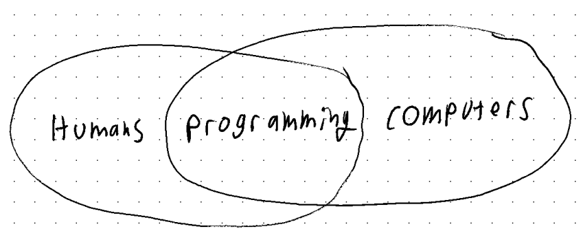

## Preamble

Welcome to programming! I’m glad you’re here.

Programming is the mysterious art of telling computers what to do.

Programming is not easy. It’s a step that makes up a large and complex process. Its semantics are mired in jargon and history, its historical development sudden and ambiguous. Learning programming is hard because there is *so much* to learn.

Learning programming is challenging because it is hard to find the answers to the actual problems you are experiencing. Imagine trying to learn how to drive, and your teacher is going on on about engines and crank shafts… but you’re hurtling down a highway right now, and asking what the road signs mean. So - because this is programming and not driving - you pause and go to the internet to research road signs but only discover information about how turn signals work and what the buttons on the dashboard do. You ask a friend for help and they start telling you about how cool motorcycles are. This is a deeply frustrating situation. There are the mechanical parts of a car, like how the engine works, but also the social-level and systems-level parts of driving, like the rules of the road, or what “validated parking” means.

> Plus, when the car crashes, the teacher claps their hand delightedly and goes “Great! Now we’re getting somewhere!”
>

This challenge is this: **Programming is a layer of abstraction layered in layers of abstraction.**

Programming is simplifying a complex process into a more usable system.

Consider how one doesn’t need to know the ins and outs of how a steering wheel and the front tires are mechanically linked. It’s enough to understand that turning the wheel will turn the tires. Programming can be like that, except that your instructors, like myself, will lie to you by constantly saying “you don’t need to worry about that”. What we mean to say is “you don’t need to worry about that **right now**. Understanding this won't get you closer to understanding the immediate problems”. Us evil instructors are just trying to help you focus.

Programming is a layer of abstraction, and it exists as one of the few layers between the human and the computer. There are layers of abstraction that go ‘higher’ up to the world of humans: patterns, vocabulary, systems diagrams, and planning tools that allow us to discuss, collaborate on, and plan programming without actually looking at or typing any code. There are many layers of abstraction that go the other way, the compiler to the operating system to the virtual machine code to the actual machine code to the logic gates to NAND gates to the  1s and 0s to the high and low voltage states of wires to the current state of transistors.

We are not going to learn most of the “lower” layers of abstraction that allow computers to work. I am not going to teach you how computers work, although I will direct you to some further resources on the topic. We will *model* how a computer works accurately enough for us to write code and solve bugs and understand why things are the way that they are - but no further. We just don’t have time. (For what it’s worth, I teach more of “how computers work” than most programming instructors!).

>  If you do want to learn "how computers work", investigate "[Nand To Tetris](https://www.nand2tetris.org/)". Additionally, one of my favorite resources that builds up a computer from scratch is the [Ben Eater 8-bit breadboard computer](https://www.youtube.com/playlist?list=PLowKtXNTBypGqImE405J2565dvjafglHU) video series on YouTube. Where he literally builds up a computer from scratch, explaining every step.

We know that learning anything requires a healthy dose of curiosity. One must engage in investigation and experimentation for the sake of discovery and learning. Learning programming requires this curiosity, but it also requires the additional skillset of looking at a mountain of confusing jargon and going “I don’t understand that, and I don’t need to understand that to do this other thing”.

> Programming, like all endeavors rooted in problem solving, requires scope management, and compartmentalization.
>

One must accept when curious questions may not reap useful answers, and put those to the side and come back to them later. Later, being when they are better equipped to investigate. I like the term “directed curiosity” or “navigable curiosity”. One must be able to do that *while* remaining curious, and not getting dejected or overwhelmed. I recommend keeping a notebook handy to jot down miscellaneous thoughts, points, questions, and so on.

There’s a dangerous and self-destructive side to this pragmatic skillset: students who **incorrectly** decide what is and isn’t important. But that’s why you have instructors and projects to steer your along. We're here to direct your curiosity. Learning something with as many layers of abstraction and as confusing jargon as programming requires a certain degree of trust in ones instructor.

Luckily, it isn’t hard. This won’t be the first time you are using these skillsets.

To phrase this in a different way, you must learn to work within the current layer of abstraction. To say “Okay so I put all the ingredients into that mysterious black box, and out the other side is my delicious 3 course meal.” Pay no attention to the man behind the curtain. (er, the chefs behind the ... box?).

# Core Concepts

## Encoding and Decoding

Morse code

“Code”, or “Computer Code”, the actual words that we write, are some logic that has been encoded and must be decoded.

## A Single Instruction

“Instruction” “Command” “Block” “Statement” “operation” etc.

Ultimately, a computer can only do one thing at a time.

## A Sequence of Instructions

So if we take all of the sequences of instructions and list them out, then feed them into a computer, we can have it do all sorts of things for us. Like math! And, in fact, computers did grow out of “adding machines” a.k.a. calculators. See the further reading section for some books on this history of computers.

What get’s really interesting, however, is not just writing up math problems for a large mechanical box to solve for me. It’s when we start taking the solutions to these problems, and feed them back into a computer to continue manipulating with. The introduction of a feedback loop is what separates computers from calculators. With feedback loops, we are not limited by the operations that a calculator can do (like “add” or “subtract”, but we can feed it new operations that are defined by sets of commands made up of operations like “add” or “subtract”. If we continued to muse on the implications philosophically, we might write the kind of paper that Alan Turing wrote when they  defined, and read up on what it means for a machine to be “turing complete”.

Computers attempt to operate instructions as fast as they possibly can. A processors “clock speed” determines how many instructions (although much lower level than the instructions that we give a computer) the processor can do per second. Modern processors are measured in “gigahertz” or in multiples of “1,000,000,000 times per second”. That’s so fast, it can feel like computers are doing things instantaneously, but we aren’t. In all of the software we will be writing*, the computer will run at one instruction at a time, in order.

## Types of Programs

Lets return to real life. Let’s think of a few ways we might categorize programs.

### User Input

Programs that run with or without any input from the user

### Loops

Does a program run once, start to finish, or does it run continuously? If we are programming video games, we are programming the latter, but learning about code involves learning the former.

I am tempted to introduce some vocabular: “Programs” for abroad all-encompassing term of any type of program, and “script” to label any contained bit of code that runs once, start to finish. This vocabulary is loosely accurate, but in the world of Unity and C# programming, we will change “script” to instead refer to a single file on our hard drive (which usually runs once, start to finish; and usually just does one thing). Complex programs may be made up of a number of scripts.

> a program is made up of systems, classes, functions, data structures, or…. sorry, I’m getting ahead of myself. We have a lot of language to talk about code, and much of it overlaps. Annoying to learn, convenient in practice: The language (such as the meaning of a word like “script”) can change depending on what layer of abstraction we are working in.