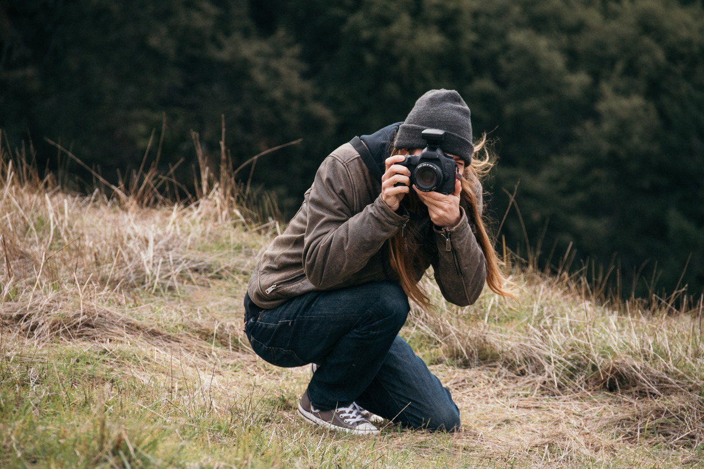

I have worked, and still occasionally freelance, as a professioanl photographer specializing in virtual reality capture, 360 photography, and image stitching.

I teach photography workshops, 1-1 lessons, and the "Pragmatic Photography" micro course at Carnegie Mellon University.

My [photography portfolio](http://notdroppingcameras.com).

My [photo blog](https://blog.notdroppingcameras.com/), where you can find my most up-to-date work.

[How To Not Drop A Camera (.com)](https://howtonotdropacamera.com/), my online photography learning resource.

These days most of my personal photography is shooting and developing film, pulling equipment from my collection of over 100 film cameras.

